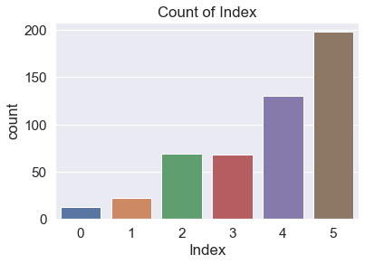
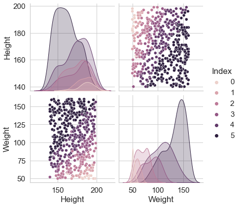
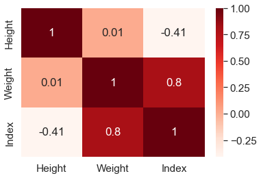
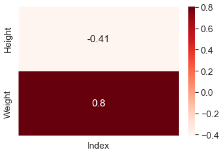
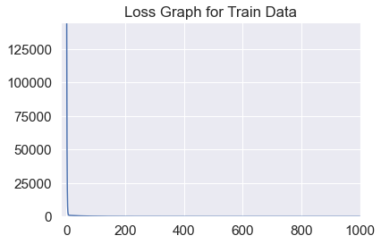
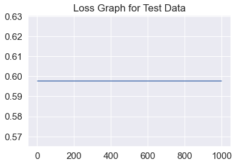
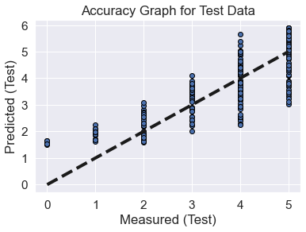
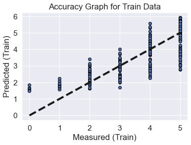

# ml-linear-regression
Machine Learning Linear Regression written from scratch

```python
# for analyzing data
import pandas as pd
import numpy as np
import seaborn as sbn
from sklearn import metrics

# for plots
import matplotlib.pyplot as plt

# for training, our own implementation
from LR import LinearRegression
```

# Exploratory Data Analysis (EDA)

## Reading and Tuning Dataset

Beden kütle indeksi verilerini okuyup "Gender" sütununu kaldırıyorum.


```python
bmi = pd.read_csv('500_Person_Gender_Height_Weight_Index.csv', header=0)
bmi = bmi.drop(columns='Gender')
```

## Dataset Summary


```python
display(bmi)
```


<div>
<table border="1" class="dataframe">
  <thead>
    <tr style="text-align: right;">
      <th></th>
      <th>Height</th>
      <th>Weight</th>
      <th>Index</th>
    </tr>
  </thead>
  <tbody>
    <tr>
      <th>0</th>
      <td>174</td>
      <td>96</td>
      <td>4</td>
    </tr>
    <tr>
      <th>1</th>
      <td>189</td>
      <td>87</td>
      <td>2</td>
    </tr>
    <tr>
      <th>2</th>
      <td>185</td>
      <td>110</td>
      <td>4</td>
    </tr>
    <tr>
      <th>3</th>
      <td>195</td>
      <td>104</td>
      <td>3</td>
    </tr>
    <tr>
      <th>4</th>
      <td>149</td>
      <td>61</td>
      <td>3</td>
    </tr>
    <tr>
      <th>...</th>
      <td>...</td>
      <td>...</td>
      <td>...</td>
    </tr>
    <tr>
      <th>495</th>
      <td>150</td>
      <td>153</td>
      <td>5</td>
    </tr>
    <tr>
      <th>496</th>
      <td>184</td>
      <td>121</td>
      <td>4</td>
    </tr>
    <tr>
      <th>497</th>
      <td>141</td>
      <td>136</td>
      <td>5</td>
    </tr>
    <tr>
      <th>498</th>
      <td>150</td>
      <td>95</td>
      <td>5</td>
    </tr>
    <tr>
      <th>499</th>
      <td>173</td>
      <td>131</td>
      <td>5</td>
    </tr>
  </tbody>
</table>
<p>500 rows × 3 columns</p>
</div>


## Summary Each Features of Data

Özet olarak 500 satirlik, standart sapması yani farklılığı en çok Weight özniteliğinde olan bir veri setimiz var. 


```python
ht = bmi['Height'].describe()
wt = bmi['Weight'].describe()
ix = bmi['Index'].describe()

print(ht)
print(wt)
print(ix)
```

    count    500.000000
    mean     169.944000
    std       16.375261
    min      140.000000
    25%      156.000000
    50%      170.500000
    75%      184.000000
    max      199.000000
    Name: Height, dtype: float64
    count    500.000000
    mean     106.000000
    std       32.382607
    min       50.000000
    25%       80.000000
    50%      106.000000
    75%      136.000000
    max      160.000000
    Name: Weight, dtype: float64
    count    500.000000
    mean       3.748000
    std        1.355053
    min        0.000000
    25%        3.000000
    50%        4.000000
    75%        5.000000
    max        5.000000
    Name: Index, dtype: float64


## Duplicated Data of Dataset

24 tane tekrarlayan verimiz var ama tekrarları çıkarmamız iyi olur mu bilmek için bir de veri setindeki tür sayılarının dengesine bakmalıyız.


```python
display(bmi[bmi.duplicated()])
display(bmi.duplicated().sum())
```


<div>
<table border="1" class="dataframe">
  <thead>
    <tr style="text-align: right;">
      <th></th>
      <th>Height</th>
      <th>Weight</th>
      <th>Index</th>
    </tr>
  </thead>
  <tbody>
    <tr>
      <th>20</th>
      <td>157</td>
      <td>110</td>
      <td>5</td>
    </tr>
    <tr>
      <th>162</th>
      <td>192</td>
      <td>101</td>
      <td>3</td>
    </tr>
    <tr>
      <th>187</th>
      <td>182</td>
      <td>84</td>
      <td>3</td>
    </tr>
    <tr>
      <th>197</th>
      <td>177</td>
      <td>117</td>
      <td>4</td>
    </tr>
    <tr>
      <th>260</th>
      <td>159</td>
      <td>104</td>
      <td>5</td>
    </tr>
    <tr>
      <th>310</th>
      <td>171</td>
      <td>147</td>
      <td>5</td>
    </tr>
    <tr>
      <th>321</th>
      <td>181</td>
      <td>111</td>
      <td>4</td>
    </tr>
    <tr>
      <th>327</th>
      <td>167</td>
      <td>85</td>
      <td>4</td>
    </tr>
    <tr>
      <th>334</th>
      <td>157</td>
      <td>56</td>
      <td>2</td>
    </tr>
    <tr>
      <th>347</th>
      <td>162</td>
      <td>58</td>
      <td>2</td>
    </tr>
    <tr>
      <th>354</th>
      <td>190</td>
      <td>50</td>
      <td>0</td>
    </tr>
    <tr>
      <th>355</th>
      <td>174</td>
      <td>90</td>
      <td>3</td>
    </tr>
    <tr>
      <th>365</th>
      <td>141</td>
      <td>80</td>
      <td>5</td>
    </tr>
    <tr>
      <th>381</th>
      <td>191</td>
      <td>62</td>
      <td>1</td>
    </tr>
    <tr>
      <th>382</th>
      <td>177</td>
      <td>117</td>
      <td>4</td>
    </tr>
    <tr>
      <th>395</th>
      <td>164</td>
      <td>71</td>
      <td>3</td>
    </tr>
    <tr>
      <th>398</th>
      <td>149</td>
      <td>61</td>
      <td>3</td>
    </tr>
    <tr>
      <th>400</th>
      <td>195</td>
      <td>104</td>
      <td>3</td>
    </tr>
    <tr>
      <th>419</th>
      <td>177</td>
      <td>61</td>
      <td>2</td>
    </tr>
    <tr>
      <th>421</th>
      <td>140</td>
      <td>146</td>
      <td>5</td>
    </tr>
    <tr>
      <th>462</th>
      <td>179</td>
      <td>56</td>
      <td>1</td>
    </tr>
    <tr>
      <th>466</th>
      <td>188</td>
      <td>99</td>
      <td>3</td>
    </tr>
    <tr>
      <th>482</th>
      <td>142</td>
      <td>86</td>
      <td>5</td>
    </tr>
    <tr>
      <th>492</th>
      <td>198</td>
      <td>50</td>
      <td>0</td>
    </tr>
  </tbody>
</table>
</div>


    24


## Checking Balance of Dataset

Aşağıdaki grafiğe baktığımızda tekrarlayan verileri çıkarmamızda bir sıkıntı olmayacağını görüyoruz, çünkü zaten veriler dengeli bir biçimde dağılmamış.


```python
plt.title('Count of Index')
sbn.countplot(bmi['Index'])
plt.show()
```

    /Users/shc/anaconda3/lib/python3.9/site-packages/seaborn/_decorators.py:36: FutureWarning: Pass the following variable as a keyword arg: x. From version 0.12, the only valid positional argument will be `data`, and passing other arguments without an explicit keyword will result in an error or misinterpretation.
      warnings.warn(


    

    


```python
bmi = bmi.drop_duplicates()
```

## Checking Null Values

Aşağıda görüleceği üzere veri setinden temizlememiz gereken null değerler yok.


```python
print(bmi.isnull().sum(axis = 0))
```

    Height    0
    Weight    0
    Index     0
    dtype: int64


## Pair-plots of Features

Aşağıdaki grafiklere baktığımızda, farklı öznitelikler için verilerin birbirine göre uzayda nasıl dağıldığını görebiliyoruz ve bu da hangi özniteliği kullanmamız gerektiği konusunda bize kabaca fikir verebilir, örneğin tek özniteliğe göre lineer regresyon yapmamız gerekseydi, grafiklere bakıldığında "Weight" özniteliğini kullanmak daha iyi sonuç verebilirdi fakat burada zaten çok az (iki tane) öznitelik olduğu için öznitelik elemesi yapmamıza gerek yok.


```python
sbn.set_style('whitegrid')
sbn.pairplot(bmi, hue='Index', height=3)
plt.show()
```


    

    


## Correlation of Features

Yine burada özniteliklerin korelasyonlarına bakarak hangilerini kullanmanın daha iyi olabileceği çıkarımına varabiliriz. Bizim için önemli olan veri setini olabildiğince lineer doğruya yaklaştırmak olduğu için korelasyonu yani ilişkisi en fazla olanlara bakmamız gerekir. "Weight" özniteliğinin "Index" ile korelasyonu daha fazla (0.8) olduğu için yine yukarıda bahsettiğimiz durum geçerli, yani "Weight" özniteliği ile daha doğrusal bir model oluşturulabilir.


```python
cm = bmi.corr()
ft = cm.drop(columns=['Height', 'Weight'])
ft = ft.drop(labels=['Index'])

sbn.set(font_scale=1.4)
sbn.heatmap(cm, annot=True, cmap=plt.cm.Reds)
plt.show()

sbn.set(font_scale=1.4)
sbn.heatmap(ft, annot=True, cmap=plt.cm.Reds)
plt.show()
```


    

    


    

    


# Training with the Linear Regression Model

Veri setini eğitmek üzere, bu dokümanın sonunda ya da "LR.py" dosyasında bulabileceğiniz daha önceden oluşturduğumuz Gradient Descent Lineer Regresyon modelini, 'learning_rate' 0.000005 ve 'epoch' 1000 olacak şekilde çağırıyoruz.


```python
clf = LinearRegression(learning_rate=0.000005, epoch=1000)
```

## Split Dataset to Train and Test

Veri setini karıştırıyoruz (shuffle) ve %50 eğitim, %50 test verisi olacak şekilde ayrıştırıyoruz.


```python
bmi = bmi.sample(frac=1).reset_index(drop=True)

portion = 0.5
n = int(portion * len(bmi))
train_bmi = bmi.iloc[0:n, :] 
test_bmi = bmi.iloc[n:len(bmi), :]

x_train = np.array(train_bmi["Height"])
y_train = np.array(train_bmi["Weight"])
z_train = np.array(train_bmi["Index"])

x_test = np.array(test_bmi["Height"])
y_test = np.array(test_bmi["Weight"])
z_test = np.array(test_bmi["Index"])
```

## Train the Classifier

Veri setini oluşturmuş olduğumuz Gradient Descent algoritmasını kullanan model sayesinde eğitiyoruz ve bu sırada her bir epoch için loss değerlerinin azalışını da ekrana bastırıp görebiliyoruz.


```python
loss_list = clf.fit(x_train, y_train, z_train)
```

    loss: 144990.75210084033  	(1/1000)
    loss: 52658.463164727014  	(2/1000)
    loss: 19516.622188028927  	(3/1000)
    loss: 7614.36519985912  	(4/1000)
    loss: 3333.7074571043763  	(5/1000)
    loss: 1788.0785394798952  	(6/1000)
    loss: 1224.0184155636791  	(7/1000)
    loss: 1012.3271755698728  	(8/1000)
    loss: 927.225390274198  	(9/1000)
    loss: 887.6938228799802  	(10/1000)
    loss: 864.657855171076  	(11/1000)
    loss: 847.6822943964291  	(12/1000)
    loss: 833.0204055880884  	(13/1000)
    loss: 819.3255220482133  	(14/1000)
    loss: 806.1122336423592  	(15/1000)
    loss: 793.2042114429092  	(16/1000)
    loss: 780.5360690180501  	(17/1000)
    loss: 768.0822633863083  	(18/1000)
    loss: 755.831581869583  	(19/1000)
    loss: 743.7779866312239  	(20/1000)
    loss: 731.9173288824215  	(21/1000)
    loss: 720.2461693214046  	(22/1000)
    loss: 708.7613543644338  	(23/1000)
    loss: 697.4598635870836  	(24/1000)
    loss: 686.3387544923755  	(25/1000)
    loss: 675.3951422106877  	(26/1000)
    loss: 664.6261917419966  	(27/1000)
    loss: 654.0291147062483  	(28/1000)
    loss: 643.6011677188337  	(29/1000)
    loss: 633.3396513565222  	(30/1000)
    loss: 623.2419093424613  	(31/1000)
    loss: 613.3053278168827  	(32/1000)
    loss: 603.5273346455241  	(33/1000)
    loss: 593.905398748449  	(34/1000)
    loss: 584.4370294429394  	(35/1000)
    loss: 575.1197757980794  	(36/1000)
    loss: 565.9512260000713  	(37/1000)
    loss: 556.9290067278386  	(38/1000)
    loss: 548.0507825386496  	(39/1000)
    loss: 539.314255263564  	(40/1000)
    loss: 530.7171634125389  	(41/1000)
    loss: 522.2572815890301  	(42/1000)
    loss: 513.9324199139359  	(43/1000)
    loss: 505.74042345873744  	(44/1000)
    loss: 497.6791716876888  	(45/1000)
    loss: 489.7465779089005  	(46/1000)
    loss: 481.9405887341952  	(47/1000)
    loss: 474.25918354757613  	(48/1000)
    loss: 466.7003739821811  	(49/1000)
    loss: 459.2622034055852  	(50/1000)
    loss: 451.942746413318  	(51/1000)
    loss: 444.7401083304651  	(52/1000)
    loss: 437.65242472121946  	(53/1000)
    loss: 430.6778609062657  	(54/1000)
    loss: 423.8146114878644  	(55/1000)
    loss: 417.06089988251904  	(56/1000)
    loss: 410.4149778610943  	(57/1000)
    loss: 403.87512509628385  	(58/1000)
    loss: 397.4396487172926  	(59/1000)
    loss: 391.1068828716318  	(60/1000)
    loss: 384.87518829390234  	(61/1000)
    loss: 378.7429518814669  	(62/1000)
    loss: 372.70858627688796  	(63/1000)
    loss: 366.7705294570352  	(64/1000)
    loss: 360.92724432874826  	(65/1000)
    loss: 355.177218330952  	(66/1000)
    loss: 349.5189630431234  	(67/1000)
    loss: 343.9510138000081  	(68/1000)
    loss: 338.4719293124849  	(69/1000)
    loss: 333.0802912944821  	(70/1000)
    loss: 327.77470409584373  	(71/1000)
    loss: 322.55379434106527  	(72/1000)
    loss: 317.41621057378376  	(73/1000)
    loss: 312.36062290695094  	(74/1000)
    loss: 307.3857226785832  	(75/1000)
    loss: 302.49022211301  	(76/1000)
    loss: 297.672853987526  	(77/1000)
    loss: 292.93237130436745  	(78/1000)
    loss: 288.2675469679166  	(79/1000)
    loss: 283.6771734670669  	(80/1000)
    loss: 279.1600625626497  	(81/1000)
    loss: 274.7150449798558  	(82/1000)
    loss: 270.3409701055613  	(83/1000)
    loss: 266.0367056904879  	(84/1000)
    loss: 261.8011375561131  	(85/1000)
    loss: 257.6331693062613  	(86/1000)
    loss: 253.5317220432965  	(87/1000)
    loss: 249.4957340888444  	(88/1000)
    loss: 245.52416070897206  	(89/1000)
    loss: 241.6159738437536  	(90/1000)
    loss: 237.77016184115362  	(91/1000)
    loss: 233.985729195154  	(92/1000)
    loss: 230.2616962880642  	(93/1000)
    loss: 226.59709913694277  	(94/1000)
    loss: 222.99098914406605  	(95/1000)
    loss: 219.44243285137733  	(96/1000)
    loss: 215.95051169886005  	(97/1000)
    loss: 212.51432178676248  	(98/1000)
    loss: 209.1329736416186  	(99/1000)
    loss: 205.80559198600554  	(100/1000)
    loss: 202.53131551197325  	(101/1000)
    loss: 199.30929665808978  	(102/1000)
    loss: 196.1387013900485  	(103/1000)
    loss: 193.01870898477276  	(104/1000)
    loss: 189.9485118179683  	(105/1000)
    loss: 186.92731515506642  	(106/1000)
    loss: 183.95433694550294  	(107/1000)
    loss: 181.02880762028076  	(108/1000)
    loss: 178.1499698927639  	(109/1000)
    loss: 175.31707856264978  	(110/1000)
    loss: 172.52940032307112  	(111/1000)
    loss: 169.7862135707761  	(112/1000)
    loss: 167.0868082193378  	(113/1000)
    loss: 164.4304855153454  	(114/1000)
    loss: 161.816557857528  	(115/1000)
    loss: 159.24434861876685  	(116/1000)
    loss: 156.7131919709468  	(117/1000)
    loss: 154.22243271260342  	(118/1000)
    loss: 151.77142609932145  	(119/1000)
    loss: 149.35953767684035  	(120/1000)
    loss: 146.98614311682076  	(121/1000)
    loss: 144.65062805523718  	(122/1000)
    loss: 142.35238793334497  	(123/1000)
    loss: 140.09082784118803  	(124/1000)
    loss: 137.86536236360422  	(125/1000)
    loss: 135.67541542868722  	(126/1000)
    loss: 133.5204201586679  	(127/1000)
    loss: 131.3998187231756  	(128/1000)
    loss: 129.31306219484136  	(129/1000)
    loss: 127.25961040720495  	(130/1000)
    loss: 125.2389318148906  	(131/1000)
    loss: 123.25050335601435  	(132/1000)
    loss: 121.29381031678678  	(133/1000)
    loss: 119.36834619827667  	(134/1000)
    loss: 117.47361258530258  	(135/1000)
    loss: 115.60911901741412  	(136/1000)
    loss: 113.77438286193554  	(137/1000)
    loss: 111.96892918903318  	(138/1000)
    loss: 110.19229064877824  	(139/1000)
    loss: 108.4440073501705  	(140/1000)
    loss: 106.72362674209371  	(141/1000)
    loss: 105.03070349617134  	(142/1000)
    loss: 103.36479939149  	(143/1000)
    loss: 101.72548320116492  	(144/1000)
    loss: 100.11233058071458  	(145/1000)
    loss: 98.52492395821731  	(146/1000)
    loss: 96.96285242622045  	(147/1000)
    loss: 95.425711635376  	(148/1000)
    loss: 93.91310368977192  	(149/1000)
    loss: 92.42463704393539  	(150/1000)
    loss: 90.95992640147998  	(151/1000)
    loss: 89.51859261536875  	(152/1000)
    loss: 88.10026258977155  	(153/1000)
    loss: 86.70456918348651  	(154/1000)
    loss: 85.33115111490446  	(155/1000)
    loss: 83.97965286848905  	(156/1000)
    loss: 82.64972460275057  	(157/1000)
    loss: 81.3410220596871  	(158/1000)
    loss: 80.05320647567237  	(159/1000)
    loss: 78.78594449376506  	(160/1000)
    loss: 77.53890807741759  	(161/1000)
    loss: 76.31177442556269  	(162/1000)
    loss: 75.10422588905473  	(163/1000)
    loss: 73.91594988844487  	(164/1000)
    loss: 72.74663883306822  	(165/1000)
    loss: 71.59599004142275  	(166/1000)
    loss: 70.46370566281891  	(167/1000)
    loss: 69.34949260027923  	(168/1000)
    loss: 68.25306243466943  	(169/1000)
    loss: 67.17413135003912  	(170/1000)
    loss: 66.11242006015542  	(171/1000)
    loss: 65.06765373620779  	(172/1000)
    loss: 64.03956193566775  	(173/1000)
    loss: 63.0278785322837  	(174/1000)
    loss: 62.03234164719241  	(175/1000)
    loss: 61.05269358113092  	(176/1000)
    loss: 60.08868074772982  	(177/1000)
    loss: 59.140053607871096  	(178/1000)
    loss: 58.206566605093975  	(179/1000)
    loss: 57.28797810203139  	(180/1000)
    loss: 56.38405031786118  	(181/1000)
    loss: 55.49454926675517  	(182/1000)
    loss: 54.619244697311345  	(183/1000)
    loss: 53.757910032951536  	(184/1000)
    loss: 52.9103223132717  	(185/1000)
    loss: 52.0762621363272  	(186/1000)
    loss: 51.25551360183981  	(187/1000)
    loss: 50.44786425531074  	(188/1000)
    loss: 49.65310503302605  	(189/1000)
    loss: 48.871030207939356  	(190/1000)
    loss: 48.10143733641854  	(191/1000)
    loss: 47.344127205842305  	(192/1000)
    loss: 46.598903783032995  	(193/1000)
    loss: 45.86557416351266  	(194/1000)
    loss: 45.14394852156857  	(195/1000)
    loss: 44.4338400611163  	(196/1000)
    loss: 43.73506496734643  	(197/1000)
    loss: 43.047442359143474  	(198/1000)
    loss: 42.370794242263784  	(199/1000)
    loss: 41.70494546326094  	(200/1000)
    loss: 41.04972366414679  	(201/1000)
    loss: 40.404959237775174  	(202/1000)
    loss: 39.770485283939074  	(203/1000)
    loss: 39.146137566167106  	(204/1000)
    loss: 38.53175446921055  	(205/1000)
    loss: 37.92717695720831  	(206/1000)
    loss: 37.332248532519934  	(207/1000)
    loss: 36.74681519521518  	(208/1000)
    loss: 36.170725403210795  	(209/1000)
    loss: 35.60383003304291  	(210/1000)
    loss: 35.04598234126573  	(211/1000)
    loss: 34.49703792646657  	(212/1000)
    loss: 33.95685469188652  	(213/1000)
    loss: 33.4252928086385  	(214/1000)
    loss: 32.90221467951145  	(215/1000)
    loss: 32.387484903353034  	(216/1000)
    loss: 31.88097024002014  	(217/1000)
    loss: 31.382539575889282  	(218/1000)
    loss: 30.89206388991717  	(219/1000)
    loss: 30.40941622024294  	(220/1000)
    loss: 29.93447163132357  	(221/1000)
    loss: 29.467107181593843  	(222/1000)
    loss: 29.007201891642094  	(223/1000)
    loss: 28.554636712894386  	(224/1000)
    loss: 28.109294496798153  	(225/1000)
    loss: 27.671059964497665  	(226/1000)
    loss: 27.2398196769938  	(227/1000)
    loss: 26.81546200577958  	(228/1000)
    loss: 26.39787710394486  	(229/1000)
    loss: 25.986956877741736  	(230/1000)
    loss: 25.58259495860403  	(231/1000)
    loss: 25.18468667561359  	(232/1000)
    loss: 24.793129028405286  	(233/1000)
    loss: 24.40782066050516  	(234/1000)
    loss: 24.028661833093857  	(235/1000)
    loss: 23.65555439918868  	(236/1000)
    loss: 23.288401778237848  	(237/1000)
    loss: 22.927108931120056  	(238/1000)
    loss: 22.57158233554341  	(239/1000)
    loss: 22.221729961836513  	(240/1000)
    loss: 21.87746124912628  	(241/1000)
    loss: 21.53868708189587  	(242/1000)
    loss: 21.205319766916624  	(243/1000)
    loss: 20.877273010548294  	(244/1000)
    loss: 20.55446189640165  	(245/1000)
    loss: 20.236802863357397  	(246/1000)
    loss: 19.92421368393595  	(247/1000)
    loss: 19.616613443012554  	(248/1000)
    loss: 19.313922516872005  	(249/1000)
    loss: 19.01606255259777  	(250/1000)
    loss: 18.722956447789752  	(251/1000)
    loss: 18.43452833060623  	(252/1000)
    loss: 18.150703540123946  	(253/1000)
    loss: 17.871408607011833  	(254/1000)
    loss: 17.596571234513128  	(255/1000)
    loss: 17.326120279731025  	(256/1000)
    loss: 17.059985735213033  	(257/1000)
    loss: 16.798098710829137  	(258/1000)
    loss: 16.54039141593942  	(259/1000)
    loss: 16.28679714184604  	(260/1000)
    loss: 16.037250244525392  	(261/1000)
    loss: 15.791686127635876  	(262/1000)
    loss: 15.55004122579683  	(263/1000)
    loss: 15.312252988134347  	(264/1000)
    loss: 15.078259862089666  	(265/1000)
    loss: 14.848001277486054  	(266/1000)
    loss: 14.621417630849912  	(267/1000)
    loss: 14.3984502699821  	(268/1000)
    loss: 14.179041478775709  	(269/1000)
    loss: 13.96313446227572  	(270/1000)
    loss: 13.750673331977644  	(271/1000)
    loss: 13.541603091360312  	(272/1000)
    loss: 13.335869621649914  	(273/1000)
    loss: 13.133419667811085  	(274/1000)
    loss: 12.934200824761449  	(275/1000)
    loss: 12.738161523806554  	(276/1000)
    loss: 12.545251019290948  	(277/1000)
    loss: 12.355419375462377  	(278/1000)
    loss: 12.168617453545869  	(279/1000)
    loss: 11.98479689902373  	(280/1000)
    loss: 11.803910129118941  	(281/1000)
    loss: 11.625910320477987  	(282/1000)
    loss: 11.450751397050544  	(283/1000)
    loss: 11.278388018162365  	(284/1000)
    loss: 11.10877556677875  	(285/1000)
    loss: 10.941870137955116  	(286/1000)
    loss: 10.777628527472105  	(287/1000)
    loss: 10.616008220651901  	(288/1000)
    loss: 10.456967381353124  	(289/1000)
    loss: 10.300464841141379  	(290/1000)
    loss: 10.14646008863261  	(291/1000)
    loss: 9.994913259006506  	(292/1000)
    loss: 9.845785123687369  	(293/1000)
    loss: 9.699037080189562  	(294/1000)
    loss: 9.554631142125144  	(295/1000)
    loss: 9.412529929370843  	(296/1000)
    loss: 9.272696658392102  	(297/1000)
    loss: 9.135095132721444  	(298/1000)
    loss: 8.999689733588896  	(299/1000)
    loss: 8.866445410701884  	(300/1000)
    loss: 8.73532767317232  	(301/1000)
    loss: 8.60630258058842  	(302/1000)
    loss: 8.479336734229177  	(303/1000)
    loss: 8.35439726841884  	(304/1000)
    loss: 8.231451842019577  	(305/1000)
    loss: 8.11046863005975  	(306/1000)
    loss: 7.991416315495914  	(307/1000)
    loss: 7.8742640811062525  	(308/1000)
    loss: 7.758981601513402  	(309/1000)
    loss: 7.645539035334564  	(310/1000)
    loss: 7.533907017456961  	(311/1000)
    loss: 7.424056651436532  	(312/1000)
    loss: 7.315959502017919  	(313/1000)
    loss: 7.209587587773942  	(314/1000)
    loss: 7.104913373862417  	(315/1000)
    loss: 7.001909764898664  	(316/1000)
    loss: 6.90055009794173  	(317/1000)
    loss: 6.800808135592577  	(318/1000)
    loss: 6.7026580592024105  	(319/1000)
    loss: 6.606074462189404  	(320/1000)
    loss: 6.511032343462056  	(321/1000)
    loss: 6.417507100947607  	(322/1000)
    loss: 6.32547452522363  	(323/1000)
    loss: 6.234910793251318  	(324/1000)
    loss: 6.145792462208799  	(325/1000)
    loss: 6.05809646342286  	(326/1000)
    loss: 5.971800096397462  	(327/1000)
    loss: 5.886881022937675  	(328/1000)
    loss: 5.803317261367317  	(329/1000)
    loss: 5.721087180838881  	(330/1000)
    loss: 5.640169495734274  	(331/1000)
    loss: 5.56054326015501  	(332/1000)
    loss: 5.482187862500196  	(333/1000)
    loss: 5.4050830201311335  	(334/1000)
    loss: 5.329208774121124  	(335/1000)
    loss: 5.254545484088922  	(336/1000)
    loss: 5.18107382311481  	(337/1000)
    loss: 5.1087747727376875  	(338/1000)
    loss: 5.037629618032072  	(339/1000)
    loss: 4.96761994276367  	(340/1000)
    loss: 4.898727624622214  	(341/1000)
    loss: 4.830934830530451  	(342/1000)
    loss: 4.764224012027967  	(343/1000)
    loss: 4.698577900728649  	(344/1000)
    loss: 4.633979503850772  	(345/1000)
    loss: 4.570412099818227  	(346/1000)
    loss: 4.507859233932136  	(347/1000)
    loss: 4.4463047141114735  	(348/1000)
    loss: 4.3857326067016595  	(349/1000)
    loss: 4.326127232350049  	(350/1000)
    loss: 4.267473161947277  	(351/1000)
    loss: 4.209755212633357  	(352/1000)
    loss: 4.152958443867539  	(353/1000)
    loss: 4.0970681535608575  	(354/1000)
    loss: 4.042069874270459  	(355/1000)
    loss: 3.9879493694546118  	(356/1000)
    loss: 3.9346926297875258  	(357/1000)
    loss: 3.8822858695329687  	(358/1000)
    loss: 3.8307155229757694  	(359/1000)
    loss: 3.779968240910277  	(360/1000)
    loss: 3.7300308871848404  	(361/1000)
    loss: 3.6808905353014634  	(362/1000)
    loss: 3.6325344650697313  	(363/1000)
    loss: 3.5849501593141277  	(364/1000)
    loss: 3.538125300633882  	(365/1000)
    loss: 3.492047768214586  	(366/1000)
    loss: 3.4467056346906544  	(367/1000)
    loss: 3.402087163057872  	(368/1000)
    loss: 3.35818080363521  	(369/1000)
    loss: 3.314975191075141  	(370/1000)
    loss: 3.272459141421675  	(371/1000)
    loss: 3.2306216492153337  	(372/1000)
    loss: 3.189451884644339  	(373/1000)
    loss: 3.148939190741265  	(374/1000)
    loss: 3.1090730806244276  	(375/1000)
    loss: 3.069843234783331  	(376/1000)
    loss: 3.0312394984073796  	(377/1000)
    loss: 2.993251878757291  	(378/1000)
    loss: 2.9558705425784098  	(379/1000)
    loss: 2.91908581355533  	(380/1000)
    loss: 2.8828881698071376  	(381/1000)
    loss: 2.84726824142264  	(382/1000)
    loss: 2.8122168080348926  	(383/1000)
    loss: 2.7777247964344824  	(384/1000)
    loss: 2.743783278220907  	(385/1000)
    loss: 2.710383467491366  	(386/1000)
    loss: 2.6775167185665447  	(387/1000)
    loss: 2.6451745237525945  	(388/1000)
    loss: 2.6133485111389194  	(389/1000)
    loss: 2.582030442431032  	(390/1000)
    loss: 2.5512122108180497  	(391/1000)
    loss: 2.52088583887422  	(392/1000)
    loss: 2.4910434764939082  	(393/1000)
    loss: 2.4616773988595657  	(394/1000)
    loss: 2.432780004442135  	(395/1000)
    loss: 2.4043438130333565  	(396/1000)
    loss: 2.3763614638094697  	(397/1000)
    loss: 2.3488257134258492  	(398/1000)
    loss: 2.3217294341420227  	(399/1000)
    loss: 2.2950656119766135  	(400/1000)
    loss: 2.26882734489176  	(401/1000)
    loss: 2.2430078410064684  	(402/1000)
    loss: 2.2176004168385264  	(403/1000)
    loss: 2.1925984955744324  	(404/1000)
    loss: 2.1679956053669747  	(405/1000)
    loss: 2.1437853776599542  	(406/1000)
    loss: 2.1199615455396494  	(407/1000)
    loss: 2.096517942112615  	(408/1000)
    loss: 2.073448498909333  	(409/1000)
    loss: 2.05074724431338  	(410/1000)
    loss: 2.0284083020156283  	(411/1000)
    loss: 2.0064258894931575  	(412/1000)
    loss: 1.984794316512402  	(413/1000)
    loss: 1.9635079836562166  	(414/1000)
    loss: 1.9425613808744508  	(415/1000)
    loss: 1.921949086057628  	(416/1000)
    loss: 1.9016657636334218  	(417/1000)
    loss: 1.8817061631855183  	(418/1000)
    loss: 1.862065118094512  	(419/1000)
    loss: 1.8427375442005114  	(420/1000)
    loss: 1.8237184384870804  	(421/1000)
    loss: 1.8050028777861844  	(422/1000)
    loss: 1.7865860175037946  	(423/1000)
    loss: 1.7684630903658622  	(424/1000)
    loss: 1.7506294051842735  	(425/1000)
    loss: 1.73308034564252  	(426/1000)
    loss: 1.7158113691007408  	(427/1000)
    loss: 1.6988180054198385  	(428/1000)
    loss: 1.6820958558043726  	(429/1000)
    loss: 1.665640591663898  	(430/1000)
    loss: 1.6494479534925  	(431/1000)
    loss: 1.6335137497661951  	(432/1000)
    loss: 1.6178338558579368  	(433/1000)
    loss: 1.6024042129699434  	(434/1000)
    loss: 1.5872208270830497  	(435/1000)
    loss: 1.5722797679228482  	(436/1000)
    loss: 1.5575771679423045  	(437/1000)
    loss: 1.5431092213206417  	(438/1000)
    loss: 1.5288721829781742  	(439/1000)
    loss: 1.5148623676068804  	(440/1000)
    loss: 1.5010761487164503  	(441/1000)
    loss: 1.4875099576955384  	(442/1000)
    loss: 1.4741602828880227  	(443/1000)
    loss: 1.4610236686839966  	(444/1000)
    loss: 1.448096714625261  	(445/1000)
    loss: 1.4353760745251054  	(446/1000)
    loss: 1.422858455602135  	(447/1000)
    loss: 1.4105406176279147  	(448/1000)
    loss: 1.3984193720882179  	(449/1000)
    loss: 1.3864915813576726  	(450/1000)
    loss: 1.3747541578875666  	(451/1000)
    loss: 1.36320406340663  	(452/1000)
    loss: 1.3518383081345486  	(453/1000)
    loss: 1.3406539500080685  	(454/1000)
    loss: 1.3296480939194046  	(455/1000)
    loss: 1.3188178909668495  	(456/1000)
    loss: 1.3081605377173087  	(457/1000)
    loss: 1.2976732754806297  	(458/1000)
    loss: 1.2873533895954892  	(459/1000)
    loss: 1.2771982087267042  	(460/1000)
    loss: 1.2672051041737376  	(461/1000)
    loss: 1.2573714891902457  	(462/1000)
    loss: 1.2476948183144945  	(463/1000)
    loss: 1.2381725867104445  	(464/1000)
    loss: 1.2288023295193715  	(465/1000)
    loss: 1.219581621221822  	(466/1000)
    loss: 1.2105080750097625  	(467/1000)
    loss: 1.2015793421687306  	(468/1000)
    loss: 1.1927931114698724  	(469/1000)
    loss: 1.1841471085716673  	(470/1000)
    loss: 1.1756390954311984  	(471/1000)
    loss: 1.1672668697248287  	(472/1000)
    loss: 1.1590282642781242  	(473/1000)
    loss: 1.150921146504862  	(474/1000)
    loss: 1.1429434178550084  	(475/1000)
    loss: 1.135093013271494  	(476/1000)
    loss: 1.127367900655667  	(477/1000)
    loss: 1.1197660803412735  	(478/1000)
    loss: 1.112285584576841  	(479/1000)
    loss: 1.1049244770163031  	(480/1000)
    loss: 1.097680852217787  	(481/1000)
    loss: 1.090552835150361  	(482/1000)
    loss: 1.0835385807086861  	(483/1000)
    loss: 1.0766362732354025  	(484/1000)
    loss: 1.0698441260511322  	(485/1000)
    loss: 1.063160380991995  	(486/1000)
    loss: 1.056583307954492  	(487/1000)
    loss: 1.0501112044476704  	(488/1000)
    loss: 1.0437423951524158  	(489/1000)
    loss: 1.0374752314877989  	(490/1000)
    loss: 1.0313080911843198  	(491/1000)
    loss: 1.0252393778639899  	(492/1000)
    loss: 1.0192675206270896  	(493/1000)
    loss: 1.0133909736455462  	(494/1000)
    loss: 1.0076082157627757  	(495/1000)
    loss: 1.0019177500999377  	(496/1000)
    loss: 0.9963181036684495  	(497/1000)
    loss: 0.9908078269887065  	(498/1000)
    loss: 0.9853854937148712  	(499/1000)
    loss: 0.9800497002656576  	(500/1000)
    loss: 0.9747990654610146  	(501/1000)
    loss: 0.9696322301645883  	(502/1000)
    loss: 0.9645478569319179  	(503/1000)
    loss: 0.9595446296642192  	(504/1000)
    loss: 0.954621253267717  	(505/1000)
    loss: 0.9497764533183972  	(506/1000)
    loss: 0.9450089757321177  	(507/1000)
    loss: 0.9403175864399865  	(508/1000)
    loss: 0.9357010710689125  	(509/1000)
    loss: 0.9311582346272618  	(510/1000)
    loss: 0.9266879011955284  	(511/1000)
    loss: 0.9222889136219445  	(512/1000)
    loss: 0.9179601332229413  	(513/1000)
    loss: 0.9137004394883989  	(514/1000)
    loss: 0.9095087297915976  	(515/1000)
    loss: 0.9053839191037952  	(516/1000)
    loss: 0.9013249397133682  	(517/1000)
    loss: 0.8973307409494179  	(518/1000)
    loss: 0.8934002889098155  	(519/1000)
    loss: 0.8895325661935575  	(520/1000)
    loss: 0.8857265716374169  	(521/1000)
    loss: 0.8819813200567804  	(522/1000)
    loss: 0.8782958419906323  	(523/1000)
    loss: 0.8746691834506056  	(524/1000)
    loss: 0.8711004056740382  	(525/1000)
    loss: 0.8675885848809631  	(526/1000)
    loss: 0.8641328120349941  	(527/1000)
    loss: 0.8607321926080119  	(528/1000)
    loss: 0.8573858463486106  	(529/1000)
    loss: 0.8540929070542409  	(530/1000)
    loss: 0.8508525223469942  	(531/1000)
    loss: 0.8476638534529543  	(532/1000)
    loss: 0.844526074985081  	(533/1000)
    loss: 0.8414383747295543  	(534/1000)
    loss: 0.838399953435528  	(535/1000)
    loss: 0.8354100246082394  	(536/1000)
    loss: 0.8324678143054248  	(537/1000)
    loss: 0.8295725609369783  	(538/1000)
    loss: 0.8267235150678084  	(539/1000)
    loss: 0.8239199392238508  	(540/1000)
    loss: 0.821161107701163  	(541/1000)
    loss: 0.8184463063780745  	(542/1000)
    loss: 0.8157748325303329  	(543/1000)
    loss: 0.8131459946492011  	(544/1000)
    loss: 0.8105591122624616  	(545/1000)
    loss: 0.8080135157582623  	(546/1000)
    loss: 0.805508546211792  	(547/1000)
    loss: 0.8030435552147166  	(548/1000)
    loss: 0.8006179047073295  	(549/1000)
    loss: 0.7982309668133912  	(550/1000)
    loss: 0.7958821236775978  	(551/1000)
    loss: 0.7935707673056489  	(552/1000)
    loss: 0.7912962994068661  	(553/1000)
    loss: 0.7890581312393169  	(554/1000)
    loss: 0.7868556834574251  	(555/1000)
    loss: 0.7846883859619954  	(556/1000)
    loss: 0.7825556777526476  	(557/1000)
    loss: 0.7804570067825968  	(558/1000)
    loss: 0.7783918298157503  	(559/1000)
    loss: 0.7763596122860943  	(560/1000)
    loss: 0.774359828159316  	(561/1000)
    loss: 0.7723919597966352  	(562/1000)
    loss: 0.7704554978208146  	(563/1000)
    loss: 0.7685499409843032  	(564/1000)
    loss: 0.7666747960394884  	(565/1000)
    loss: 0.7648295776110121  	(566/1000)
    loss: 0.7630138080701346  	(567/1000)
    loss: 0.7612270174110956  	(568/1000)
    loss: 0.7594687431294476  	(569/1000)
    loss: 0.7577385301023387  	(570/1000)
    loss: 0.7560359304707063  	(571/1000)
    loss: 0.7543605035233351  	(572/1000)
    loss: 0.7527118155827857  	(573/1000)
    loss: 0.7510894398931354  	(574/1000)
    loss: 0.7494929565095024  	(575/1000)
    loss: 0.747921952189353  	(576/1000)
    loss: 0.7463760202855214  	(577/1000)
    loss: 0.7448547606409541  	(578/1000)
    loss: 0.7433577794851228  	(579/1000)
    loss: 0.7418846893320985  	(580/1000)
    loss: 0.740435108880246  	(581/1000)
    loss: 0.7390086629135257  	(582/1000)
    loss: 0.7376049822043633  	(583/1000)
    loss: 0.7362237034180779  	(584/1000)
    loss: 0.7348644690188266  	(585/1000)
    loss: 0.7335269271770585  	(586/1000)
    loss: 0.7322107316784401  	(587/1000)
    loss: 0.7309155418342363  	(588/1000)
    loss: 0.7296410223931208  	(589/1000)
    loss: 0.7283868434543974  	(590/1000)
    loss: 0.7271526803826005  	(591/1000)
    loss: 0.7259382137234645  	(592/1000)
    loss: 0.7247431291212296  	(593/1000)
    loss: 0.723567117237271  	(594/1000)
    loss: 0.7224098736700232  	(595/1000)
    loss: 0.7212710988761852  	(596/1000)
    loss: 0.720150498093182  	(597/1000)
    loss: 0.7190477812628682  	(598/1000)
    loss: 0.7179626629564365  	(599/1000)
    loss: 0.7168948623005403  	(600/1000)
    loss: 0.7158441029045874  	(601/1000)
    loss: 0.7148101127891922  	(602/1000)
    loss: 0.7137926243157712  	(603/1000)
    loss: 0.7127913741172718  	(604/1000)
    loss: 0.7118061030299906  	(605/1000)
    loss: 0.7108365560264904  	(606/1000)
    loss: 0.7098824821495836  	(607/1000)
    loss: 0.708943634447374  	(608/1000)
    loss: 0.7080197699093314  	(609/1000)
    loss: 0.7071106494033836  	(610/1000)
    loss: 0.7062160376140189  	(611/1000)
    loss: 0.7053357029813756  	(612/1000)
    loss: 0.704469417641297  	(613/1000)
    loss: 0.7036169573663511  	(614/1000)
    loss: 0.7027781015077867  	(615/1000)
    loss: 0.7019526329384191  	(616/1000)
    loss: 0.7011403379964232  	(617/1000)
    loss: 0.700341006430028  	(618/1000)
    loss: 0.6995544313430928  	(619/1000)
    loss: 0.6987804091415479  	(620/1000)
    loss: 0.6980187394806983  	(621/1000)
    loss: 0.6972692252133568  	(622/1000)
    loss: 0.6965316723388183  	(623/1000)
    loss: 0.6958058899526396  	(624/1000)
    loss: 0.6950916901972183  	(625/1000)
    loss: 0.6943888882131745  	(626/1000)
    loss: 0.6936973020914883  	(627/1000)
    loss: 0.693016752826421  	(628/1000)
    loss: 0.6923470642691715  	(629/1000)
    loss: 0.6916880630822853  	(630/1000)
    loss: 0.6910395786947812  	(631/1000)
    loss: 0.6904014432579996  	(632/1000)
    loss: 0.6897734916021556  	(633/1000)
    loss: 0.6891555611935793  	(634/1000)
    loss: 0.6885474920926515  	(635/1000)
    loss: 0.687949126912393  	(636/1000)
    loss: 0.6873603107777313  	(637/1000)
    loss: 0.6867808912854063  	(638/1000)
    loss: 0.6862107184645241  	(639/1000)
    loss: 0.6856496447377329  	(640/1000)
    loss: 0.6850975248830213  	(641/1000)
    loss: 0.6845542159961315  	(642/1000)
    loss: 0.6840195774535637  	(643/1000)
    loss: 0.6834934708761754  	(644/1000)
    loss: 0.6829757600933658  	(645/1000)
    loss: 0.6824663111078181  	(646/1000)
    loss: 0.6819649920608255  	(647/1000)
    loss: 0.6814716731981502  	(648/1000)
    loss: 0.6809862268364372  	(649/1000)
    loss: 0.6805085273301681  	(650/1000)
    loss: 0.6800384510391301  	(651/1000)
    loss: 0.6795758762964161  	(652/1000)
    loss: 0.6791206833769297  	(653/1000)
    loss: 0.678672754466392  	(654/1000)
    loss: 0.6782319736308473  	(655/1000)
    loss: 0.6777982267866495  	(656/1000)
    loss: 0.6773714016709355  	(657/1000)
    loss: 0.6769513878125629  	(658/1000)
    loss: 0.6765380765035133  	(659/1000)
    loss: 0.6761313607707553  	(660/1000)
    loss: 0.6757311353485529  	(661/1000)
    loss: 0.675337296651214  	(662/1000)
    loss: 0.6749497427462823  	(663/1000)
    loss: 0.6745683733281473  	(664/1000)
    loss: 0.6741930896920822  	(665/1000)
    loss: 0.6738237947086914  	(666/1000)
    loss: 0.6734603927987699  	(667/1000)
    loss: 0.6731027899085624  	(668/1000)
    loss: 0.672750893485417  	(669/1000)
    loss: 0.6724046124538249  	(670/1000)
    loss: 0.672063857191847  	(671/1000)
    loss: 0.6717285395079187  	(672/1000)
    loss: 0.6713985726180122  	(673/1000)
    loss: 0.6710738711231798  	(674/1000)
    loss: 0.6707543509874473  	(675/1000)
    loss: 0.6704399295160554  	(676/1000)
    loss: 0.6701305253340589  	(677/1000)
    loss: 0.6698260583652612  	(678/1000)
    loss: 0.6695264498114857  	(679/1000)
    loss: 0.6692316221321791  	(680/1000)
    loss: 0.6689414990243387  	(681/1000)
    loss: 0.6686560054027628  	(682/1000)
    loss: 0.668375067380611  	(683/1000)
    loss: 0.6680986122502833  	(684/1000)
    loss: 0.6678265684645946  	(685/1000)
    loss: 0.667558865618259  	(686/1000)
    loss: 0.6672954344296597  	(687/1000)
    loss: 0.6670362067229202  	(688/1000)
    loss: 0.6667811154102551  	(689/1000)
    loss: 0.6665300944745989  	(690/1000)
    loss: 0.6662830789525291  	(691/1000)
    loss: 0.6660400049174362  	(692/1000)
    loss: 0.6658008094629866  	(693/1000)
    loss: 0.6655654306868337  	(694/1000)
    loss: 0.6653338076745947  	(695/1000)
    loss: 0.6651058804840858  	(696/1000)
    loss: 0.664881590129801  	(697/1000)
    loss: 0.6646608785676478  	(698/1000)
    loss: 0.6644436886799187  	(699/1000)
    loss: 0.6642299642605107  	(700/1000)
    loss: 0.6640196500003691  	(701/1000)
    loss: 0.6638126914731778  	(702/1000)
    loss: 0.6636090351212669  	(703/1000)
    loss: 0.6634086282417478  	(704/1000)
    loss: 0.6632114189728746  	(705/1000)
    loss: 0.6630173562806171  	(706/1000)
    loss: 0.6628263899454507  	(707/1000)
    loss: 0.6626384705493576  	(708/1000)
    loss: 0.6624535494630327  	(709/1000)
    loss: 0.6622715788332978  	(710/1000)
    loss: 0.6620925115707152  	(711/1000)
    loss: 0.6619163013373942  	(712/1000)
    loss: 0.6617429025350027  	(713/1000)
    loss: 0.6615722702929577  	(714/1000)
    loss: 0.6614043604568126  	(715/1000)
    loss: 0.6612391295768312  	(716/1000)
    loss: 0.6610765348967346  	(717/1000)
    loss: 0.6609165343426376  	(718/1000)
    loss: 0.6607590865121552  	(719/1000)
    loss: 0.6606041506636877  	(720/1000)
    loss: 0.6604516867058728  	(721/1000)
    loss: 0.6603016551872092  	(722/1000)
    loss: 0.6601540172858418  	(723/1000)
    loss: 0.6600087347995173  	(724/1000)
    loss: 0.6598657701356889  	(725/1000)
    loss: 0.6597250863017909  	(726/1000)
    loss: 0.659586646895661  	(727/1000)
    loss: 0.6594504160961165  	(728/1000)
    loss: 0.6593163586536813  	(729/1000)
    loss: 0.6591844398814664  	(730/1000)
    loss: 0.6590546256461839  	(731/1000)
    loss: 0.6589268823593168  	(732/1000)
    loss: 0.6588011769684221  	(733/1000)
    loss: 0.6586774769485734  	(734/1000)
    loss: 0.6585557502939485  	(735/1000)
    loss: 0.6584359655095363  	(736/1000)
    loss: 0.6583180916029867  	(737/1000)
    loss: 0.658202098076593  	(738/1000)
    loss: 0.6580879549193901  	(739/1000)
    loss: 0.6579756325993913  	(740/1000)
    loss: 0.6578651020559408  	(741/1000)
    loss: 0.657756334692192  	(742/1000)
    loss: 0.657649302367708  	(743/1000)
    loss: 0.6575439773911722  	(744/1000)
    loss: 0.6574403325132234  	(745/1000)
    loss: 0.6573383409194029  	(746/1000)
    loss: 0.6572379762232098  	(747/1000)
    loss: 0.657139212459275  	(748/1000)
    loss: 0.6570420240766369  	(749/1000)
    loss: 0.6569463859321294  	(750/1000)
    loss: 0.6568522732838729  	(751/1000)
    loss: 0.6567596617848676  	(752/1000)
    loss: 0.6566685274766958  	(753/1000)
    loss: 0.6565788467833151  	(754/1000)
    loss: 0.6564905965049596  	(755/1000)
    loss: 0.6564037538121301  	(756/1000)
    loss: 0.6563182962396915  	(757/1000)
    loss: 0.6562342016810496  	(758/1000)
    loss: 0.6561514483824357  	(759/1000)
    loss: 0.6560700149372701  	(760/1000)
    loss: 0.6559898802806237  	(761/1000)
    loss: 0.6559110236837659  	(762/1000)
    loss: 0.6558334247487951  	(763/1000)
    loss: 0.6557570634033657  	(764/1000)
    loss: 0.655681919895482  	(765/1000)
    loss: 0.6556079747883983  	(766/1000)
    loss: 0.6555352089555725  	(767/1000)
    loss: 0.655463603575728  	(768/1000)
    loss: 0.6553931401279766  	(769/1000)
    loss: 0.6553238003870224  	(770/1000)
    loss: 0.6552555664184486  	(771/1000)
    loss: 0.6551884205740699  	(772/1000)
    loss: 0.6551223454873685  	(773/1000)
    loss: 0.6550573240689971  	(774/1000)
    loss: 0.6549933395023549  	(775/1000)
    loss: 0.6549303752392361  	(776/1000)
    loss: 0.6548684149955434  	(777/1000)
    loss: 0.654807442747075  	(778/1000)
    loss: 0.6547474427253774  	(779/1000)
    loss: 0.6546883994136594  	(780/1000)
    loss: 0.6546302975427822  	(781/1000)
    loss: 0.6545731220873029  	(782/1000)
    loss: 0.654516858261582  	(783/1000)
    loss: 0.6544614915159623  	(784/1000)
    loss: 0.6544070075329999  	(785/1000)
    loss: 0.6543533922237564  	(786/1000)
    loss: 0.6543006317241579  	(787/1000)
    loss: 0.6542487123913939  	(788/1000)
    loss: 0.6541976208004027  	(789/1000)
    loss: 0.6541473437403807  	(790/1000)
    loss: 0.6540978682113731  	(791/1000)
    loss: 0.654049181420903  	(792/1000)
    loss: 0.6540012707806634  	(793/1000)
    loss: 0.6539541239032564  	(794/1000)
    loss: 0.6539077285989887  	(795/1000)
    loss: 0.6538620728727144  	(796/1000)
    loss: 0.6538171449207301  	(797/1000)
    loss: 0.6537729331277218  	(798/1000)
    loss: 0.6537294260637547  	(799/1000)
    loss: 0.653686612481318  	(800/1000)
    loss: 0.6536444813124099  	(801/1000)
    loss: 0.6536030216656761  	(802/1000)
    loss: 0.6535622228235884  	(803/1000)
    loss: 0.6535220742396713  	(804/1000)
    loss: 0.6534825655357708  	(805/1000)
    loss: 0.653443686499368  	(806/1000)
    loss: 0.6534054270809382  	(807/1000)
    loss: 0.6533677773913467  	(808/1000)
    loss: 0.6533307276992898  	(809/1000)
    loss: 0.6532942684287769  	(810/1000)
    loss: 0.6532583901566494  	(811/1000)
    loss: 0.6532230836101435  	(812/1000)
    loss: 0.6531883396644892  	(813/1000)
    loss: 0.6531541493405477  	(814/1000)
    loss: 0.6531205038024878  	(815/1000)
    loss: 0.6530873943554998  	(816/1000)
    loss: 0.6530548124435422  	(817/1000)
    loss: 0.6530227496471293  	(818/1000)
    loss: 0.65299119768115  	(819/1000)
    loss: 0.6529601483927244  	(820/1000)
    loss: 0.6529295937590939  	(821/1000)
    loss: 0.6528995258855421  	(822/1000)
    loss: 0.6528699370033532  	(823/1000)
    loss: 0.6528408194677998  	(824/1000)
    loss: 0.6528121657561679  	(825/1000)
    loss: 0.6527839684658008  	(826/1000)
    loss: 0.6527562203121946  	(827/1000)
    loss: 0.6527289141271024  	(828/1000)
    loss: 0.6527020428566837  	(829/1000)
    loss: 0.6526755995596784  	(830/1000)
    loss: 0.6526495774056091  	(831/1000)
    loss: 0.652623969673014  	(832/1000)
    loss: 0.6525987697477035  	(833/1000)
    loss: 0.6525739711210534  	(834/1000)
    loss: 0.6525495673883164  	(835/1000)
    loss: 0.6525255522469655  	(836/1000)
    loss: 0.6525019194950628  	(837/1000)
    loss: 0.6524786630296527  	(838/1000)
    loss: 0.6524557768451826  	(839/1000)
    loss: 0.6524332550319523  	(840/1000)
    loss: 0.6524110917745759  	(841/1000)
    loss: 0.6523892813504848  	(842/1000)
    loss: 0.6523678181284409  	(843/1000)
    loss: 0.6523466965670833  	(844/1000)
    loss: 0.6523259112134886  	(845/1000)
    loss: 0.6523054567017648  	(846/1000)
    loss: 0.652285327751658  	(847/1000)
    loss: 0.652265519167188  	(848/1000)
    loss: 0.6522460258353043  	(849/1000)
    loss: 0.6522268427245582  	(850/1000)
    loss: 0.6522079648838051  	(851/1000)
    loss: 0.6521893874409206  	(852/1000)
    loss: 0.6521711056015382  	(853/1000)
    loss: 0.6521531146478122  	(854/1000)
    loss: 0.6521354099371931  	(855/1000)
    loss: 0.6521179869012248  	(856/1000)
    loss: 0.6521008410443668  	(857/1000)
    loss: 0.652083967942825  	(858/1000)
    loss: 0.6520673632434125  	(859/1000)
    loss: 0.6520510226624169  	(860/1000)
    loss: 0.6520349419844935  	(861/1000)
    loss: 0.6520191170615788  	(862/1000)
    loss: 0.6520035438118077  	(863/1000)
    loss: 0.6519882182184645  	(864/1000)
    loss: 0.6519731363289399  	(865/1000)
    loss: 0.651958294253709  	(866/1000)
    loss: 0.6519436881653239  	(867/1000)
    loss: 0.6519293142974218  	(868/1000)
    loss: 0.6519151689437516  	(869/1000)
    loss: 0.6519012484572162  	(870/1000)
    loss: 0.6518875492489221  	(871/1000)
    loss: 0.6518740677872599  	(872/1000)
    loss: 0.6518608005969813  	(873/1000)
    loss: 0.6518477442583043  	(874/1000)
    loss: 0.6518348954060265  	(875/1000)
    loss: 0.6518222507286542  	(876/1000)
    loss: 0.6518098069675455  	(877/1000)
    loss: 0.651797560916068  	(878/1000)
    loss: 0.6517855094187642  	(879/1000)
    loss: 0.6517736493705403  	(880/1000)
    loss: 0.65176197771586  	(881/1000)
    loss: 0.6517504914479525  	(882/1000)
    loss: 0.6517391876080344  	(883/1000)
    loss: 0.6517280632845467  	(884/1000)
    loss: 0.651717115612398  	(885/1000)
    loss: 0.6517063417722243  	(886/1000)
    loss: 0.6516957389896575  	(887/1000)
    loss: 0.6516853045346112  	(888/1000)
    loss: 0.6516750357205681  	(889/1000)
    loss: 0.6516649299038899  	(890/1000)
    loss: 0.6516549844831309  	(891/1000)
    loss: 0.651645196898364  	(892/1000)
    loss: 0.6516355646305179  	(893/1000)
    loss: 0.6516260852007283  	(894/1000)
    loss: 0.6516167561696905  	(895/1000)
    loss: 0.6516075751370335  	(896/1000)
    loss: 0.6515985397406959  	(897/1000)
    loss: 0.6515896476563147  	(898/1000)
    loss: 0.6515808965966239  	(899/1000)
    loss: 0.6515722843108617  	(900/1000)
    loss: 0.6515638085841899  	(901/1000)
    loss: 0.6515554672371185  	(902/1000)
    loss: 0.6515472581249417  	(903/1000)
    loss: 0.6515391791371848  	(904/1000)
    loss: 0.6515312281970549  	(905/1000)
    loss: 0.6515234032609059  	(906/1000)
    loss: 0.6515157023177075  	(907/1000)
    loss: 0.6515081233885262  	(908/1000)
    loss: 0.6515006645260127  	(909/1000)
    loss: 0.6514933238138952  	(910/1000)
    loss: 0.6514860993664902  	(911/1000)
    loss: 0.6514789893282041  	(912/1000)
    loss: 0.6514719918730636  	(913/1000)
    loss: 0.6514651052042356  	(914/1000)
    loss: 0.6514583275535657  	(915/1000)
    loss: 0.6514516571811165  	(916/1000)
    loss: 0.6514450923747243  	(917/1000)
    loss: 0.6514386314495496  	(918/1000)
    loss: 0.6514322727476412  	(919/1000)
    loss: 0.6514260146375126  	(920/1000)
    loss: 0.6514198555137128  	(921/1000)
    loss: 0.6514137937964147  	(922/1000)
    loss: 0.651407827931007  	(923/1000)
    loss: 0.6514019563876885  	(924/1000)
    loss: 0.6513961776610735  	(925/1000)
    loss: 0.6513904902698024  	(926/1000)
    loss: 0.6513848927561597  	(927/1000)
    loss: 0.6513793836856931  	(928/1000)
    loss: 0.6513739616468451  	(929/1000)
    loss: 0.6513686252505874  	(930/1000)
    loss: 0.6513633731300592  	(931/1000)
    loss: 0.6513582039402169  	(932/1000)
    loss: 0.6513531163574807  	(933/1000)
    loss: 0.6513481090793993  	(934/1000)
    loss: 0.6513431808243052  	(935/1000)
    loss: 0.6513383303309869  	(936/1000)
    loss: 0.651333556358365  	(937/1000)
    loss: 0.6513288576851627  	(938/1000)
    loss: 0.6513242331095999  	(939/1000)
    loss: 0.6513196814490733  	(940/1000)
    loss: 0.6513152015398559  	(941/1000)
    loss: 0.6513107922367924  	(942/1000)
    loss: 0.6513064524130054  	(943/1000)
    loss: 0.651302180959603  	(944/1000)
    loss: 0.6512979767853897  	(945/1000)
    loss: 0.6512938388165866  	(946/1000)
    loss: 0.6512897659965524  	(947/1000)
    loss: 0.6512857572855093  	(948/1000)
    loss: 0.651281811660275  	(949/1000)
    loss: 0.6512779281139959  	(950/1000)
    loss: 0.6512741056558905  	(951/1000)
    loss: 0.6512703433109873  	(952/1000)
    loss: 0.6512666401198768  	(953/1000)
    loss: 0.6512629951384615  	(954/1000)
    loss: 0.651259407437712  	(955/1000)
    loss: 0.6512558761034266  	(956/1000)
    loss: 0.6512524002359927  	(957/1000)
    loss: 0.6512489789501581  	(958/1000)
    loss: 0.6512456113747963  	(959/1000)
    loss: 0.6512422966526865  	(960/1000)
    loss: 0.6512390339402884  	(961/1000)
    loss: 0.6512358224075243  	(962/1000)
    loss: 0.6512326612375643  	(963/1000)
    loss: 0.6512295496266156  	(964/1000)
    loss: 0.6512264867837138  	(965/1000)
    loss: 0.6512234719305203  	(966/1000)
    loss: 0.6512205043011154  	(967/1000)
    loss: 0.6512175831418051  	(968/1000)
    loss: 0.6512147077109255  	(969/1000)
    loss: 0.6512118772786475  	(970/1000)
    loss: 0.651209091126791  	(971/1000)
    loss: 0.6512063485486409  	(972/1000)
    loss: 0.6512036488487559  	(973/1000)
    loss: 0.6512009913427977  	(974/1000)
    loss: 0.6511983753573501  	(975/1000)
    loss: 0.651195800229744  	(976/1000)
    loss: 0.6511932653078844  	(977/1000)
    loss: 0.6511907699500864  	(978/1000)
    loss: 0.6511883135249069  	(979/1000)
    loss: 0.6511858954109775  	(980/1000)
    loss: 0.6511835149968511  	(981/1000)
    loss: 0.6511811716808354  	(982/1000)
    loss: 0.6511788648708433  	(983/1000)
    loss: 0.6511765939842378  	(984/1000)
    loss: 0.651174358447678  	(985/1000)
    loss: 0.6511721576969773  	(986/1000)
    loss: 0.6511699911769498  	(987/1000)
    loss: 0.6511678583412757  	(988/1000)
    loss: 0.6511657586523484  	(989/1000)
    loss: 0.6511636915811437  	(990/1000)
    loss: 0.6511616566070845  	(991/1000)
    loss: 0.6511596532178957  	(992/1000)
    loss: 0.6511576809094825  	(993/1000)
    loss: 0.6511557391857951  	(994/1000)
    loss: 0.651153827558698  	(995/1000)
    loss: 0.6511519455478498  	(996/1000)
    loss: 0.6511500926805724  	(997/1000)
    loss: 0.6511482684917355  	(998/1000)
    loss: 0.6511464725236278  	(999/1000)
    loss: 0.6511447043258447  	(1000/1000)


Aşağıda görülebileceği üzere train ve test için loss graph'leri çizdiriyoruz, train'de beklendiği gibi 0'a yaklaşıyor, test'te ise sabit kalıyor çünkü model önceden eğitildiği için loss çok değişmiyor.


```python
epochs = []
for x in range(1,1001):
    epochs.append(x)

plt.plot(epochs, loss_list)
plt.title('Loss Graph for Train Data')
plt.xlim(-20, 1000)
plt.ylim(-20, loss_list[0])
plt.show()
```


    

    


```python
loss_list = clf.get_loss(x_test, y_test, z_test)
```

    loss: 0.5978244192488105  	(1/1000)
    loss: 0.5978244192488105  	(2/1000)
    loss: 0.5978244192488105  	(3/1000)
    loss: 0.5978244192488105  	(4/1000)
    loss: 0.5978244192488105  	(5/1000)
    loss: 0.5978244192488105  	(6/1000)
    loss: 0.5978244192488105  	(7/1000)
    loss: 0.5978244192488105  	(8/1000)
    loss: 0.5978244192488105  	(9/1000)
    loss: 0.5978244192488105  	(10/1000)
    loss: 0.5978244192488105  	(11/1000)
    loss: 0.5978244192488105  	(12/1000)
    loss: 0.5978244192488105  	(13/1000)
    loss: 0.5978244192488105  	(14/1000)
    loss: 0.5978244192488105  	(15/1000)
    loss: 0.5978244192488105  	(16/1000)
    loss: 0.5978244192488105  	(17/1000)
    loss: 0.5978244192488105  	(18/1000)
    loss: 0.5978244192488105  	(19/1000)
    loss: 0.5978244192488105  	(20/1000)
    loss: 0.5978244192488105  	(21/1000)
    loss: 0.5978244192488105  	(22/1000)
    loss: 0.5978244192488105  	(23/1000)
    loss: 0.5978244192488105  	(24/1000)
    loss: 0.5978244192488105  	(25/1000)
    loss: 0.5978244192488105  	(26/1000)
    loss: 0.5978244192488105  	(27/1000)
    loss: 0.5978244192488105  	(28/1000)
    loss: 0.5978244192488105  	(29/1000)
    loss: 0.5978244192488105  	(30/1000)
    loss: 0.5978244192488105  	(31/1000)
    loss: 0.5978244192488105  	(32/1000)
    loss: 0.5978244192488105  	(33/1000)
    loss: 0.5978244192488105  	(34/1000)
    loss: 0.5978244192488105  	(35/1000)
    loss: 0.5978244192488105  	(36/1000)
    loss: 0.5978244192488105  	(37/1000)
    loss: 0.5978244192488105  	(38/1000)
    loss: 0.5978244192488105  	(39/1000)
    loss: 0.5978244192488105  	(40/1000)
    loss: 0.5978244192488105  	(41/1000)
    loss: 0.5978244192488105  	(42/1000)
    loss: 0.5978244192488105  	(43/1000)
    loss: 0.5978244192488105  	(44/1000)
    loss: 0.5978244192488105  	(45/1000)
    loss: 0.5978244192488105  	(46/1000)
    loss: 0.5978244192488105  	(47/1000)
    loss: 0.5978244192488105  	(48/1000)
    loss: 0.5978244192488105  	(49/1000)
    loss: 0.5978244192488105  	(50/1000)
    loss: 0.5978244192488105  	(51/1000)
    loss: 0.5978244192488105  	(52/1000)
    loss: 0.5978244192488105  	(53/1000)
    loss: 0.5978244192488105  	(54/1000)
    loss: 0.5978244192488105  	(55/1000)
    loss: 0.5978244192488105  	(56/1000)
    loss: 0.5978244192488105  	(57/1000)
    loss: 0.5978244192488105  	(58/1000)
    loss: 0.5978244192488105  	(59/1000)
    loss: 0.5978244192488105  	(60/1000)
    loss: 0.5978244192488105  	(61/1000)
    loss: 0.5978244192488105  	(62/1000)
    loss: 0.5978244192488105  	(63/1000)
    loss: 0.5978244192488105  	(64/1000)
    loss: 0.5978244192488105  	(65/1000)
    loss: 0.5978244192488105  	(66/1000)
    loss: 0.5978244192488105  	(67/1000)
    loss: 0.5978244192488105  	(68/1000)
    loss: 0.5978244192488105  	(69/1000)
    loss: 0.5978244192488105  	(70/1000)
    loss: 0.5978244192488105  	(71/1000)
    loss: 0.5978244192488105  	(72/1000)
    loss: 0.5978244192488105  	(73/1000)
    loss: 0.5978244192488105  	(74/1000)
    loss: 0.5978244192488105  	(75/1000)
    loss: 0.5978244192488105  	(76/1000)
    loss: 0.5978244192488105  	(77/1000)
    loss: 0.5978244192488105  	(78/1000)
    loss: 0.5978244192488105  	(79/1000)
    loss: 0.5978244192488105  	(80/1000)
    loss: 0.5978244192488105  	(81/1000)
    loss: 0.5978244192488105  	(82/1000)
    loss: 0.5978244192488105  	(83/1000)
    loss: 0.5978244192488105  	(84/1000)
    loss: 0.5978244192488105  	(85/1000)
    loss: 0.5978244192488105  	(86/1000)
    loss: 0.5978244192488105  	(87/1000)
    loss: 0.5978244192488105  	(88/1000)
    loss: 0.5978244192488105  	(89/1000)
    loss: 0.5978244192488105  	(90/1000)
    loss: 0.5978244192488105  	(91/1000)
    loss: 0.5978244192488105  	(92/1000)
    loss: 0.5978244192488105  	(93/1000)
    loss: 0.5978244192488105  	(94/1000)
    loss: 0.5978244192488105  	(95/1000)
    loss: 0.5978244192488105  	(96/1000)
    loss: 0.5978244192488105  	(97/1000)
    loss: 0.5978244192488105  	(98/1000)
    loss: 0.5978244192488105  	(99/1000)
    loss: 0.5978244192488105  	(100/1000)
    loss: 0.5978244192488105  	(101/1000)
    loss: 0.5978244192488105  	(102/1000)
    loss: 0.5978244192488105  	(103/1000)
    loss: 0.5978244192488105  	(104/1000)
    loss: 0.5978244192488105  	(105/1000)
    loss: 0.5978244192488105  	(106/1000)
    loss: 0.5978244192488105  	(107/1000)
    loss: 0.5978244192488105  	(108/1000)
    loss: 0.5978244192488105  	(109/1000)
    loss: 0.5978244192488105  	(110/1000)
    loss: 0.5978244192488105  	(111/1000)
    loss: 0.5978244192488105  	(112/1000)
    loss: 0.5978244192488105  	(113/1000)
    loss: 0.5978244192488105  	(114/1000)
    loss: 0.5978244192488105  	(115/1000)
    loss: 0.5978244192488105  	(116/1000)
    loss: 0.5978244192488105  	(117/1000)
    loss: 0.5978244192488105  	(118/1000)
    loss: 0.5978244192488105  	(119/1000)
    loss: 0.5978244192488105  	(120/1000)
    loss: 0.5978244192488105  	(121/1000)
    loss: 0.5978244192488105  	(122/1000)
    loss: 0.5978244192488105  	(123/1000)
    loss: 0.5978244192488105  	(124/1000)
    loss: 0.5978244192488105  	(125/1000)
    loss: 0.5978244192488105  	(126/1000)
    loss: 0.5978244192488105  	(127/1000)
    loss: 0.5978244192488105  	(128/1000)
    loss: 0.5978244192488105  	(129/1000)
    loss: 0.5978244192488105  	(130/1000)
    loss: 0.5978244192488105  	(131/1000)
    loss: 0.5978244192488105  	(132/1000)
    loss: 0.5978244192488105  	(133/1000)
    loss: 0.5978244192488105  	(134/1000)
    loss: 0.5978244192488105  	(135/1000)
    loss: 0.5978244192488105  	(136/1000)
    loss: 0.5978244192488105  	(137/1000)
    loss: 0.5978244192488105  	(138/1000)
    loss: 0.5978244192488105  	(139/1000)
    loss: 0.5978244192488105  	(140/1000)
    loss: 0.5978244192488105  	(141/1000)
    loss: 0.5978244192488105  	(142/1000)
    loss: 0.5978244192488105  	(143/1000)
    loss: 0.5978244192488105  	(144/1000)
    loss: 0.5978244192488105  	(145/1000)
    loss: 0.5978244192488105  	(146/1000)
    loss: 0.5978244192488105  	(147/1000)
    loss: 0.5978244192488105  	(148/1000)
    loss: 0.5978244192488105  	(149/1000)
    loss: 0.5978244192488105  	(150/1000)
    loss: 0.5978244192488105  	(151/1000)
    loss: 0.5978244192488105  	(152/1000)
    loss: 0.5978244192488105  	(153/1000)
    loss: 0.5978244192488105  	(154/1000)
    loss: 0.5978244192488105  	(155/1000)
    loss: 0.5978244192488105  	(156/1000)
    loss: 0.5978244192488105  	(157/1000)
    loss: 0.5978244192488105  	(158/1000)
    loss: 0.5978244192488105  	(159/1000)
    loss: 0.5978244192488105  	(160/1000)
    loss: 0.5978244192488105  	(161/1000)
    loss: 0.5978244192488105  	(162/1000)
    loss: 0.5978244192488105  	(163/1000)
    loss: 0.5978244192488105  	(164/1000)
    loss: 0.5978244192488105  	(165/1000)
    loss: 0.5978244192488105  	(166/1000)
    loss: 0.5978244192488105  	(167/1000)
    loss: 0.5978244192488105  	(168/1000)
    loss: 0.5978244192488105  	(169/1000)
    loss: 0.5978244192488105  	(170/1000)
    loss: 0.5978244192488105  	(171/1000)
    loss: 0.5978244192488105  	(172/1000)
    loss: 0.5978244192488105  	(173/1000)
    loss: 0.5978244192488105  	(174/1000)
    loss: 0.5978244192488105  	(175/1000)
    loss: 0.5978244192488105  	(176/1000)
    loss: 0.5978244192488105  	(177/1000)
    loss: 0.5978244192488105  	(178/1000)
    loss: 0.5978244192488105  	(179/1000)
    loss: 0.5978244192488105  	(180/1000)
    loss: 0.5978244192488105  	(181/1000)
    loss: 0.5978244192488105  	(182/1000)
    loss: 0.5978244192488105  	(183/1000)
    loss: 0.5978244192488105  	(184/1000)
    loss: 0.5978244192488105  	(185/1000)
    loss: 0.5978244192488105  	(186/1000)
    loss: 0.5978244192488105  	(187/1000)
    loss: 0.5978244192488105  	(188/1000)
    loss: 0.5978244192488105  	(189/1000)
    loss: 0.5978244192488105  	(190/1000)
    loss: 0.5978244192488105  	(191/1000)
    loss: 0.5978244192488105  	(192/1000)
    loss: 0.5978244192488105  	(193/1000)
    loss: 0.5978244192488105  	(194/1000)
    loss: 0.5978244192488105  	(195/1000)
    loss: 0.5978244192488105  	(196/1000)
    loss: 0.5978244192488105  	(197/1000)
    loss: 0.5978244192488105  	(198/1000)
    loss: 0.5978244192488105  	(199/1000)
    loss: 0.5978244192488105  	(200/1000)
    loss: 0.5978244192488105  	(201/1000)
    loss: 0.5978244192488105  	(202/1000)
    loss: 0.5978244192488105  	(203/1000)
    loss: 0.5978244192488105  	(204/1000)
    loss: 0.5978244192488105  	(205/1000)
    loss: 0.5978244192488105  	(206/1000)
    loss: 0.5978244192488105  	(207/1000)
    loss: 0.5978244192488105  	(208/1000)
    loss: 0.5978244192488105  	(209/1000)
    loss: 0.5978244192488105  	(210/1000)
    loss: 0.5978244192488105  	(211/1000)
    loss: 0.5978244192488105  	(212/1000)
    loss: 0.5978244192488105  	(213/1000)
    loss: 0.5978244192488105  	(214/1000)
    loss: 0.5978244192488105  	(215/1000)
    loss: 0.5978244192488105  	(216/1000)
    loss: 0.5978244192488105  	(217/1000)
    loss: 0.5978244192488105  	(218/1000)
    loss: 0.5978244192488105  	(219/1000)
    loss: 0.5978244192488105  	(220/1000)
    loss: 0.5978244192488105  	(221/1000)
    loss: 0.5978244192488105  	(222/1000)
    loss: 0.5978244192488105  	(223/1000)
    loss: 0.5978244192488105  	(224/1000)
    loss: 0.5978244192488105  	(225/1000)
    loss: 0.5978244192488105  	(226/1000)
    loss: 0.5978244192488105  	(227/1000)
    loss: 0.5978244192488105  	(228/1000)
    loss: 0.5978244192488105  	(229/1000)
    loss: 0.5978244192488105  	(230/1000)
    loss: 0.5978244192488105  	(231/1000)
    loss: 0.5978244192488105  	(232/1000)
    loss: 0.5978244192488105  	(233/1000)
    loss: 0.5978244192488105  	(234/1000)
    loss: 0.5978244192488105  	(235/1000)
    loss: 0.5978244192488105  	(236/1000)
    loss: 0.5978244192488105  	(237/1000)
    loss: 0.5978244192488105  	(238/1000)
    loss: 0.5978244192488105  	(239/1000)
    loss: 0.5978244192488105  	(240/1000)
    loss: 0.5978244192488105  	(241/1000)
    loss: 0.5978244192488105  	(242/1000)
    loss: 0.5978244192488105  	(243/1000)
    loss: 0.5978244192488105  	(244/1000)
    loss: 0.5978244192488105  	(245/1000)
    loss: 0.5978244192488105  	(246/1000)
    loss: 0.5978244192488105  	(247/1000)
    loss: 0.5978244192488105  	(248/1000)
    loss: 0.5978244192488105  	(249/1000)
    loss: 0.5978244192488105  	(250/1000)
    loss: 0.5978244192488105  	(251/1000)
    loss: 0.5978244192488105  	(252/1000)
    loss: 0.5978244192488105  	(253/1000)
    loss: 0.5978244192488105  	(254/1000)
    loss: 0.5978244192488105  	(255/1000)
    loss: 0.5978244192488105  	(256/1000)
    loss: 0.5978244192488105  	(257/1000)
    loss: 0.5978244192488105  	(258/1000)
    loss: 0.5978244192488105  	(259/1000)
    loss: 0.5978244192488105  	(260/1000)
    loss: 0.5978244192488105  	(261/1000)
    loss: 0.5978244192488105  	(262/1000)
    loss: 0.5978244192488105  	(263/1000)
    loss: 0.5978244192488105  	(264/1000)
    loss: 0.5978244192488105  	(265/1000)
    loss: 0.5978244192488105  	(266/1000)
    loss: 0.5978244192488105  	(267/1000)
    loss: 0.5978244192488105  	(268/1000)
    loss: 0.5978244192488105  	(269/1000)
    loss: 0.5978244192488105  	(270/1000)
    loss: 0.5978244192488105  	(271/1000)
    loss: 0.5978244192488105  	(272/1000)
    loss: 0.5978244192488105  	(273/1000)
    loss: 0.5978244192488105  	(274/1000)
    loss: 0.5978244192488105  	(275/1000)
    loss: 0.5978244192488105  	(276/1000)
    loss: 0.5978244192488105  	(277/1000)
    loss: 0.5978244192488105  	(278/1000)
    loss: 0.5978244192488105  	(279/1000)
    loss: 0.5978244192488105  	(280/1000)
    loss: 0.5978244192488105  	(281/1000)
    loss: 0.5978244192488105  	(282/1000)
    loss: 0.5978244192488105  	(283/1000)
    loss: 0.5978244192488105  	(284/1000)
    loss: 0.5978244192488105  	(285/1000)
    loss: 0.5978244192488105  	(286/1000)
    loss: 0.5978244192488105  	(287/1000)
    loss: 0.5978244192488105  	(288/1000)
    loss: 0.5978244192488105  	(289/1000)
    loss: 0.5978244192488105  	(290/1000)
    loss: 0.5978244192488105  	(291/1000)
    loss: 0.5978244192488105  	(292/1000)
    loss: 0.5978244192488105  	(293/1000)
    loss: 0.5978244192488105  	(294/1000)
    loss: 0.5978244192488105  	(295/1000)
    loss: 0.5978244192488105  	(296/1000)
    loss: 0.5978244192488105  	(297/1000)
    loss: 0.5978244192488105  	(298/1000)
    loss: 0.5978244192488105  	(299/1000)
    loss: 0.5978244192488105  	(300/1000)
    loss: 0.5978244192488105  	(301/1000)
    loss: 0.5978244192488105  	(302/1000)
    loss: 0.5978244192488105  	(303/1000)
    loss: 0.5978244192488105  	(304/1000)
    loss: 0.5978244192488105  	(305/1000)
    loss: 0.5978244192488105  	(306/1000)
    loss: 0.5978244192488105  	(307/1000)
    loss: 0.5978244192488105  	(308/1000)
    loss: 0.5978244192488105  	(309/1000)
    loss: 0.5978244192488105  	(310/1000)
    loss: 0.5978244192488105  	(311/1000)
    loss: 0.5978244192488105  	(312/1000)
    loss: 0.5978244192488105  	(313/1000)
    loss: 0.5978244192488105  	(314/1000)
    loss: 0.5978244192488105  	(315/1000)
    loss: 0.5978244192488105  	(316/1000)
    loss: 0.5978244192488105  	(317/1000)
    loss: 0.5978244192488105  	(318/1000)
    loss: 0.5978244192488105  	(319/1000)
    loss: 0.5978244192488105  	(320/1000)
    loss: 0.5978244192488105  	(321/1000)
    loss: 0.5978244192488105  	(322/1000)
    loss: 0.5978244192488105  	(323/1000)
    loss: 0.5978244192488105  	(324/1000)
    loss: 0.5978244192488105  	(325/1000)
    loss: 0.5978244192488105  	(326/1000)
    loss: 0.5978244192488105  	(327/1000)
    loss: 0.5978244192488105  	(328/1000)
    loss: 0.5978244192488105  	(329/1000)
    loss: 0.5978244192488105  	(330/1000)
    loss: 0.5978244192488105  	(331/1000)
    loss: 0.5978244192488105  	(332/1000)
    loss: 0.5978244192488105  	(333/1000)
    loss: 0.5978244192488105  	(334/1000)
    loss: 0.5978244192488105  	(335/1000)
    loss: 0.5978244192488105  	(336/1000)
    loss: 0.5978244192488105  	(337/1000)
    loss: 0.5978244192488105  	(338/1000)
    loss: 0.5978244192488105  	(339/1000)
    loss: 0.5978244192488105  	(340/1000)
    loss: 0.5978244192488105  	(341/1000)
    loss: 0.5978244192488105  	(342/1000)
    loss: 0.5978244192488105  	(343/1000)
    loss: 0.5978244192488105  	(344/1000)
    loss: 0.5978244192488105  	(345/1000)
    loss: 0.5978244192488105  	(346/1000)
    loss: 0.5978244192488105  	(347/1000)
    loss: 0.5978244192488105  	(348/1000)
    loss: 0.5978244192488105  	(349/1000)
    loss: 0.5978244192488105  	(350/1000)
    loss: 0.5978244192488105  	(351/1000)
    loss: 0.5978244192488105  	(352/1000)
    loss: 0.5978244192488105  	(353/1000)
    loss: 0.5978244192488105  	(354/1000)
    loss: 0.5978244192488105  	(355/1000)
    loss: 0.5978244192488105  	(356/1000)
    loss: 0.5978244192488105  	(357/1000)
    loss: 0.5978244192488105  	(358/1000)
    loss: 0.5978244192488105  	(359/1000)
    loss: 0.5978244192488105  	(360/1000)
    loss: 0.5978244192488105  	(361/1000)
    loss: 0.5978244192488105  	(362/1000)
    loss: 0.5978244192488105  	(363/1000)
    loss: 0.5978244192488105  	(364/1000)
    loss: 0.5978244192488105  	(365/1000)
    loss: 0.5978244192488105  	(366/1000)
    loss: 0.5978244192488105  	(367/1000)
    loss: 0.5978244192488105  	(368/1000)
    loss: 0.5978244192488105  	(369/1000)
    loss: 0.5978244192488105  	(370/1000)
    loss: 0.5978244192488105  	(371/1000)
    loss: 0.5978244192488105  	(372/1000)
    loss: 0.5978244192488105  	(373/1000)
    loss: 0.5978244192488105  	(374/1000)
    loss: 0.5978244192488105  	(375/1000)
    loss: 0.5978244192488105  	(376/1000)
    loss: 0.5978244192488105  	(377/1000)
    loss: 0.5978244192488105  	(378/1000)
    loss: 0.5978244192488105  	(379/1000)
    loss: 0.5978244192488105  	(380/1000)
    loss: 0.5978244192488105  	(381/1000)
    loss: 0.5978244192488105  	(382/1000)
    loss: 0.5978244192488105  	(383/1000)
    loss: 0.5978244192488105  	(384/1000)
    loss: 0.5978244192488105  	(385/1000)
    loss: 0.5978244192488105  	(386/1000)
    loss: 0.5978244192488105  	(387/1000)
    loss: 0.5978244192488105  	(388/1000)
    loss: 0.5978244192488105  	(389/1000)
    loss: 0.5978244192488105  	(390/1000)
    loss: 0.5978244192488105  	(391/1000)
    loss: 0.5978244192488105  	(392/1000)
    loss: 0.5978244192488105  	(393/1000)
    loss: 0.5978244192488105  	(394/1000)
    loss: 0.5978244192488105  	(395/1000)
    loss: 0.5978244192488105  	(396/1000)
    loss: 0.5978244192488105  	(397/1000)
    loss: 0.5978244192488105  	(398/1000)
    loss: 0.5978244192488105  	(399/1000)
    loss: 0.5978244192488105  	(400/1000)
    loss: 0.5978244192488105  	(401/1000)
    loss: 0.5978244192488105  	(402/1000)
    loss: 0.5978244192488105  	(403/1000)
    loss: 0.5978244192488105  	(404/1000)
    loss: 0.5978244192488105  	(405/1000)
    loss: 0.5978244192488105  	(406/1000)
    loss: 0.5978244192488105  	(407/1000)
    loss: 0.5978244192488105  	(408/1000)
    loss: 0.5978244192488105  	(409/1000)
    loss: 0.5978244192488105  	(410/1000)
    loss: 0.5978244192488105  	(411/1000)
    loss: 0.5978244192488105  	(412/1000)
    loss: 0.5978244192488105  	(413/1000)
    loss: 0.5978244192488105  	(414/1000)
    loss: 0.5978244192488105  	(415/1000)
    loss: 0.5978244192488105  	(416/1000)
    loss: 0.5978244192488105  	(417/1000)
    loss: 0.5978244192488105  	(418/1000)
    loss: 0.5978244192488105  	(419/1000)
    loss: 0.5978244192488105  	(420/1000)
    loss: 0.5978244192488105  	(421/1000)
    loss: 0.5978244192488105  	(422/1000)
    loss: 0.5978244192488105  	(423/1000)
    loss: 0.5978244192488105  	(424/1000)
    loss: 0.5978244192488105  	(425/1000)
    loss: 0.5978244192488105  	(426/1000)
    loss: 0.5978244192488105  	(427/1000)
    loss: 0.5978244192488105  	(428/1000)
    loss: 0.5978244192488105  	(429/1000)
    loss: 0.5978244192488105  	(430/1000)
    loss: 0.5978244192488105  	(431/1000)
    loss: 0.5978244192488105  	(432/1000)
    loss: 0.5978244192488105  	(433/1000)
    loss: 0.5978244192488105  	(434/1000)
    loss: 0.5978244192488105  	(435/1000)
    loss: 0.5978244192488105  	(436/1000)
    loss: 0.5978244192488105  	(437/1000)
    loss: 0.5978244192488105  	(438/1000)
    loss: 0.5978244192488105  	(439/1000)
    loss: 0.5978244192488105  	(440/1000)
    loss: 0.5978244192488105  	(441/1000)
    loss: 0.5978244192488105  	(442/1000)
    loss: 0.5978244192488105  	(443/1000)
    loss: 0.5978244192488105  	(444/1000)
    loss: 0.5978244192488105  	(445/1000)
    loss: 0.5978244192488105  	(446/1000)
    loss: 0.5978244192488105  	(447/1000)
    loss: 0.5978244192488105  	(448/1000)
    loss: 0.5978244192488105  	(449/1000)
    loss: 0.5978244192488105  	(450/1000)
    loss: 0.5978244192488105  	(451/1000)
    loss: 0.5978244192488105  	(452/1000)
    loss: 0.5978244192488105  	(453/1000)
    loss: 0.5978244192488105  	(454/1000)
    loss: 0.5978244192488105  	(455/1000)
    loss: 0.5978244192488105  	(456/1000)
    loss: 0.5978244192488105  	(457/1000)
    loss: 0.5978244192488105  	(458/1000)
    loss: 0.5978244192488105  	(459/1000)
    loss: 0.5978244192488105  	(460/1000)
    loss: 0.5978244192488105  	(461/1000)
    loss: 0.5978244192488105  	(462/1000)
    loss: 0.5978244192488105  	(463/1000)
    loss: 0.5978244192488105  	(464/1000)
    loss: 0.5978244192488105  	(465/1000)
    loss: 0.5978244192488105  	(466/1000)
    loss: 0.5978244192488105  	(467/1000)
    loss: 0.5978244192488105  	(468/1000)
    loss: 0.5978244192488105  	(469/1000)
    loss: 0.5978244192488105  	(470/1000)
    loss: 0.5978244192488105  	(471/1000)
    loss: 0.5978244192488105  	(472/1000)
    loss: 0.5978244192488105  	(473/1000)
    loss: 0.5978244192488105  	(474/1000)
    loss: 0.5978244192488105  	(475/1000)
    loss: 0.5978244192488105  	(476/1000)
    loss: 0.5978244192488105  	(477/1000)
    loss: 0.5978244192488105  	(478/1000)
    loss: 0.5978244192488105  	(479/1000)
    loss: 0.5978244192488105  	(480/1000)
    loss: 0.5978244192488105  	(481/1000)
    loss: 0.5978244192488105  	(482/1000)
    loss: 0.5978244192488105  	(483/1000)
    loss: 0.5978244192488105  	(484/1000)
    loss: 0.5978244192488105  	(485/1000)
    loss: 0.5978244192488105  	(486/1000)
    loss: 0.5978244192488105  	(487/1000)
    loss: 0.5978244192488105  	(488/1000)
    loss: 0.5978244192488105  	(489/1000)
    loss: 0.5978244192488105  	(490/1000)
    loss: 0.5978244192488105  	(491/1000)
    loss: 0.5978244192488105  	(492/1000)
    loss: 0.5978244192488105  	(493/1000)
    loss: 0.5978244192488105  	(494/1000)
    loss: 0.5978244192488105  	(495/1000)
    loss: 0.5978244192488105  	(496/1000)
    loss: 0.5978244192488105  	(497/1000)
    loss: 0.5978244192488105  	(498/1000)
    loss: 0.5978244192488105  	(499/1000)
    loss: 0.5978244192488105  	(500/1000)
    loss: 0.5978244192488105  	(501/1000)
    loss: 0.5978244192488105  	(502/1000)
    loss: 0.5978244192488105  	(503/1000)
    loss: 0.5978244192488105  	(504/1000)
    loss: 0.5978244192488105  	(505/1000)
    loss: 0.5978244192488105  	(506/1000)
    loss: 0.5978244192488105  	(507/1000)
    loss: 0.5978244192488105  	(508/1000)
    loss: 0.5978244192488105  	(509/1000)
    loss: 0.5978244192488105  	(510/1000)
    loss: 0.5978244192488105  	(511/1000)
    loss: 0.5978244192488105  	(512/1000)
    loss: 0.5978244192488105  	(513/1000)
    loss: 0.5978244192488105  	(514/1000)
    loss: 0.5978244192488105  	(515/1000)
    loss: 0.5978244192488105  	(516/1000)
    loss: 0.5978244192488105  	(517/1000)
    loss: 0.5978244192488105  	(518/1000)
    loss: 0.5978244192488105  	(519/1000)
    loss: 0.5978244192488105  	(520/1000)
    loss: 0.5978244192488105  	(521/1000)
    loss: 0.5978244192488105  	(522/1000)
    loss: 0.5978244192488105  	(523/1000)
    loss: 0.5978244192488105  	(524/1000)
    loss: 0.5978244192488105  	(525/1000)
    loss: 0.5978244192488105  	(526/1000)
    loss: 0.5978244192488105  	(527/1000)
    loss: 0.5978244192488105  	(528/1000)
    loss: 0.5978244192488105  	(529/1000)
    loss: 0.5978244192488105  	(530/1000)
    loss: 0.5978244192488105  	(531/1000)
    loss: 0.5978244192488105  	(532/1000)
    loss: 0.5978244192488105  	(533/1000)
    loss: 0.5978244192488105  	(534/1000)
    loss: 0.5978244192488105  	(535/1000)
    loss: 0.5978244192488105  	(536/1000)
    loss: 0.5978244192488105  	(537/1000)
    loss: 0.5978244192488105  	(538/1000)
    loss: 0.5978244192488105  	(539/1000)
    loss: 0.5978244192488105  	(540/1000)
    loss: 0.5978244192488105  	(541/1000)
    loss: 0.5978244192488105  	(542/1000)
    loss: 0.5978244192488105  	(543/1000)
    loss: 0.5978244192488105  	(544/1000)
    loss: 0.5978244192488105  	(545/1000)
    loss: 0.5978244192488105  	(546/1000)
    loss: 0.5978244192488105  	(547/1000)
    loss: 0.5978244192488105  	(548/1000)
    loss: 0.5978244192488105  	(549/1000)
    loss: 0.5978244192488105  	(550/1000)
    loss: 0.5978244192488105  	(551/1000)
    loss: 0.5978244192488105  	(552/1000)
    loss: 0.5978244192488105  	(553/1000)
    loss: 0.5978244192488105  	(554/1000)
    loss: 0.5978244192488105  	(555/1000)
    loss: 0.5978244192488105  	(556/1000)
    loss: 0.5978244192488105  	(557/1000)
    loss: 0.5978244192488105  	(558/1000)
    loss: 0.5978244192488105  	(559/1000)
    loss: 0.5978244192488105  	(560/1000)
    loss: 0.5978244192488105  	(561/1000)
    loss: 0.5978244192488105  	(562/1000)
    loss: 0.5978244192488105  	(563/1000)
    loss: 0.5978244192488105  	(564/1000)
    loss: 0.5978244192488105  	(565/1000)
    loss: 0.5978244192488105  	(566/1000)
    loss: 0.5978244192488105  	(567/1000)
    loss: 0.5978244192488105  	(568/1000)
    loss: 0.5978244192488105  	(569/1000)
    loss: 0.5978244192488105  	(570/1000)
    loss: 0.5978244192488105  	(571/1000)
    loss: 0.5978244192488105  	(572/1000)
    loss: 0.5978244192488105  	(573/1000)
    loss: 0.5978244192488105  	(574/1000)
    loss: 0.5978244192488105  	(575/1000)
    loss: 0.5978244192488105  	(576/1000)
    loss: 0.5978244192488105  	(577/1000)
    loss: 0.5978244192488105  	(578/1000)
    loss: 0.5978244192488105  	(579/1000)
    loss: 0.5978244192488105  	(580/1000)
    loss: 0.5978244192488105  	(581/1000)
    loss: 0.5978244192488105  	(582/1000)
    loss: 0.5978244192488105  	(583/1000)
    loss: 0.5978244192488105  	(584/1000)
    loss: 0.5978244192488105  	(585/1000)
    loss: 0.5978244192488105  	(586/1000)
    loss: 0.5978244192488105  	(587/1000)
    loss: 0.5978244192488105  	(588/1000)
    loss: 0.5978244192488105  	(589/1000)
    loss: 0.5978244192488105  	(590/1000)
    loss: 0.5978244192488105  	(591/1000)
    loss: 0.5978244192488105  	(592/1000)
    loss: 0.5978244192488105  	(593/1000)
    loss: 0.5978244192488105  	(594/1000)
    loss: 0.5978244192488105  	(595/1000)
    loss: 0.5978244192488105  	(596/1000)
    loss: 0.5978244192488105  	(597/1000)
    loss: 0.5978244192488105  	(598/1000)
    loss: 0.5978244192488105  	(599/1000)
    loss: 0.5978244192488105  	(600/1000)
    loss: 0.5978244192488105  	(601/1000)
    loss: 0.5978244192488105  	(602/1000)
    loss: 0.5978244192488105  	(603/1000)
    loss: 0.5978244192488105  	(604/1000)
    loss: 0.5978244192488105  	(605/1000)
    loss: 0.5978244192488105  	(606/1000)
    loss: 0.5978244192488105  	(607/1000)
    loss: 0.5978244192488105  	(608/1000)
    loss: 0.5978244192488105  	(609/1000)
    loss: 0.5978244192488105  	(610/1000)
    loss: 0.5978244192488105  	(611/1000)
    loss: 0.5978244192488105  	(612/1000)
    loss: 0.5978244192488105  	(613/1000)
    loss: 0.5978244192488105  	(614/1000)
    loss: 0.5978244192488105  	(615/1000)
    loss: 0.5978244192488105  	(616/1000)
    loss: 0.5978244192488105  	(617/1000)
    loss: 0.5978244192488105  	(618/1000)
    loss: 0.5978244192488105  	(619/1000)
    loss: 0.5978244192488105  	(620/1000)
    loss: 0.5978244192488105  	(621/1000)
    loss: 0.5978244192488105  	(622/1000)
    loss: 0.5978244192488105  	(623/1000)
    loss: 0.5978244192488105  	(624/1000)
    loss: 0.5978244192488105  	(625/1000)
    loss: 0.5978244192488105  	(626/1000)
    loss: 0.5978244192488105  	(627/1000)
    loss: 0.5978244192488105  	(628/1000)
    loss: 0.5978244192488105  	(629/1000)
    loss: 0.5978244192488105  	(630/1000)
    loss: 0.5978244192488105  	(631/1000)
    loss: 0.5978244192488105  	(632/1000)
    loss: 0.5978244192488105  	(633/1000)
    loss: 0.5978244192488105  	(634/1000)
    loss: 0.5978244192488105  	(635/1000)
    loss: 0.5978244192488105  	(636/1000)
    loss: 0.5978244192488105  	(637/1000)
    loss: 0.5978244192488105  	(638/1000)
    loss: 0.5978244192488105  	(639/1000)
    loss: 0.5978244192488105  	(640/1000)
    loss: 0.5978244192488105  	(641/1000)
    loss: 0.5978244192488105  	(642/1000)
    loss: 0.5978244192488105  	(643/1000)
    loss: 0.5978244192488105  	(644/1000)
    loss: 0.5978244192488105  	(645/1000)
    loss: 0.5978244192488105  	(646/1000)
    loss: 0.5978244192488105  	(647/1000)
    loss: 0.5978244192488105  	(648/1000)
    loss: 0.5978244192488105  	(649/1000)
    loss: 0.5978244192488105  	(650/1000)
    loss: 0.5978244192488105  	(651/1000)
    loss: 0.5978244192488105  	(652/1000)
    loss: 0.5978244192488105  	(653/1000)
    loss: 0.5978244192488105  	(654/1000)
    loss: 0.5978244192488105  	(655/1000)
    loss: 0.5978244192488105  	(656/1000)
    loss: 0.5978244192488105  	(657/1000)
    loss: 0.5978244192488105  	(658/1000)
    loss: 0.5978244192488105  	(659/1000)
    loss: 0.5978244192488105  	(660/1000)
    loss: 0.5978244192488105  	(661/1000)
    loss: 0.5978244192488105  	(662/1000)
    loss: 0.5978244192488105  	(663/1000)
    loss: 0.5978244192488105  	(664/1000)
    loss: 0.5978244192488105  	(665/1000)
    loss: 0.5978244192488105  	(666/1000)
    loss: 0.5978244192488105  	(667/1000)
    loss: 0.5978244192488105  	(668/1000)
    loss: 0.5978244192488105  	(669/1000)
    loss: 0.5978244192488105  	(670/1000)
    loss: 0.5978244192488105  	(671/1000)
    loss: 0.5978244192488105  	(672/1000)
    loss: 0.5978244192488105  	(673/1000)
    loss: 0.5978244192488105  	(674/1000)
    loss: 0.5978244192488105  	(675/1000)
    loss: 0.5978244192488105  	(676/1000)
    loss: 0.5978244192488105  	(677/1000)
    loss: 0.5978244192488105  	(678/1000)
    loss: 0.5978244192488105  	(679/1000)
    loss: 0.5978244192488105  	(680/1000)
    loss: 0.5978244192488105  	(681/1000)
    loss: 0.5978244192488105  	(682/1000)
    loss: 0.5978244192488105  	(683/1000)
    loss: 0.5978244192488105  	(684/1000)
    loss: 0.5978244192488105  	(685/1000)
    loss: 0.5978244192488105  	(686/1000)
    loss: 0.5978244192488105  	(687/1000)
    loss: 0.5978244192488105  	(688/1000)
    loss: 0.5978244192488105  	(689/1000)
    loss: 0.5978244192488105  	(690/1000)
    loss: 0.5978244192488105  	(691/1000)
    loss: 0.5978244192488105  	(692/1000)
    loss: 0.5978244192488105  	(693/1000)
    loss: 0.5978244192488105  	(694/1000)
    loss: 0.5978244192488105  	(695/1000)
    loss: 0.5978244192488105  	(696/1000)
    loss: 0.5978244192488105  	(697/1000)
    loss: 0.5978244192488105  	(698/1000)
    loss: 0.5978244192488105  	(699/1000)
    loss: 0.5978244192488105  	(700/1000)
    loss: 0.5978244192488105  	(701/1000)
    loss: 0.5978244192488105  	(702/1000)
    loss: 0.5978244192488105  	(703/1000)
    loss: 0.5978244192488105  	(704/1000)
    loss: 0.5978244192488105  	(705/1000)
    loss: 0.5978244192488105  	(706/1000)
    loss: 0.5978244192488105  	(707/1000)
    loss: 0.5978244192488105  	(708/1000)
    loss: 0.5978244192488105  	(709/1000)
    loss: 0.5978244192488105  	(710/1000)
    loss: 0.5978244192488105  	(711/1000)
    loss: 0.5978244192488105  	(712/1000)
    loss: 0.5978244192488105  	(713/1000)
    loss: 0.5978244192488105  	(714/1000)
    loss: 0.5978244192488105  	(715/1000)
    loss: 0.5978244192488105  	(716/1000)
    loss: 0.5978244192488105  	(717/1000)
    loss: 0.5978244192488105  	(718/1000)
    loss: 0.5978244192488105  	(719/1000)
    loss: 0.5978244192488105  	(720/1000)
    loss: 0.5978244192488105  	(721/1000)
    loss: 0.5978244192488105  	(722/1000)
    loss: 0.5978244192488105  	(723/1000)
    loss: 0.5978244192488105  	(724/1000)
    loss: 0.5978244192488105  	(725/1000)
    loss: 0.5978244192488105  	(726/1000)
    loss: 0.5978244192488105  	(727/1000)
    loss: 0.5978244192488105  	(728/1000)
    loss: 0.5978244192488105  	(729/1000)
    loss: 0.5978244192488105  	(730/1000)
    loss: 0.5978244192488105  	(731/1000)
    loss: 0.5978244192488105  	(732/1000)
    loss: 0.5978244192488105  	(733/1000)
    loss: 0.5978244192488105  	(734/1000)
    loss: 0.5978244192488105  	(735/1000)
    loss: 0.5978244192488105  	(736/1000)
    loss: 0.5978244192488105  	(737/1000)
    loss: 0.5978244192488105  	(738/1000)
    loss: 0.5978244192488105  	(739/1000)
    loss: 0.5978244192488105  	(740/1000)
    loss: 0.5978244192488105  	(741/1000)
    loss: 0.5978244192488105  	(742/1000)
    loss: 0.5978244192488105  	(743/1000)
    loss: 0.5978244192488105  	(744/1000)
    loss: 0.5978244192488105  	(745/1000)
    loss: 0.5978244192488105  	(746/1000)
    loss: 0.5978244192488105  	(747/1000)
    loss: 0.5978244192488105  	(748/1000)
    loss: 0.5978244192488105  	(749/1000)
    loss: 0.5978244192488105  	(750/1000)
    loss: 0.5978244192488105  	(751/1000)
    loss: 0.5978244192488105  	(752/1000)
    loss: 0.5978244192488105  	(753/1000)
    loss: 0.5978244192488105  	(754/1000)
    loss: 0.5978244192488105  	(755/1000)
    loss: 0.5978244192488105  	(756/1000)
    loss: 0.5978244192488105  	(757/1000)
    loss: 0.5978244192488105  	(758/1000)
    loss: 0.5978244192488105  	(759/1000)
    loss: 0.5978244192488105  	(760/1000)
    loss: 0.5978244192488105  	(761/1000)
    loss: 0.5978244192488105  	(762/1000)
    loss: 0.5978244192488105  	(763/1000)
    loss: 0.5978244192488105  	(764/1000)
    loss: 0.5978244192488105  	(765/1000)
    loss: 0.5978244192488105  	(766/1000)
    loss: 0.5978244192488105  	(767/1000)
    loss: 0.5978244192488105  	(768/1000)
    loss: 0.5978244192488105  	(769/1000)
    loss: 0.5978244192488105  	(770/1000)
    loss: 0.5978244192488105  	(771/1000)
    loss: 0.5978244192488105  	(772/1000)
    loss: 0.5978244192488105  	(773/1000)
    loss: 0.5978244192488105  	(774/1000)
    loss: 0.5978244192488105  	(775/1000)
    loss: 0.5978244192488105  	(776/1000)
    loss: 0.5978244192488105  	(777/1000)
    loss: 0.5978244192488105  	(778/1000)
    loss: 0.5978244192488105  	(779/1000)
    loss: 0.5978244192488105  	(780/1000)
    loss: 0.5978244192488105  	(781/1000)
    loss: 0.5978244192488105  	(782/1000)
    loss: 0.5978244192488105  	(783/1000)
    loss: 0.5978244192488105  	(784/1000)
    loss: 0.5978244192488105  	(785/1000)
    loss: 0.5978244192488105  	(786/1000)
    loss: 0.5978244192488105  	(787/1000)
    loss: 0.5978244192488105  	(788/1000)
    loss: 0.5978244192488105  	(789/1000)
    loss: 0.5978244192488105  	(790/1000)
    loss: 0.5978244192488105  	(791/1000)
    loss: 0.5978244192488105  	(792/1000)
    loss: 0.5978244192488105  	(793/1000)
    loss: 0.5978244192488105  	(794/1000)
    loss: 0.5978244192488105  	(795/1000)
    loss: 0.5978244192488105  	(796/1000)
    loss: 0.5978244192488105  	(797/1000)
    loss: 0.5978244192488105  	(798/1000)
    loss: 0.5978244192488105  	(799/1000)
    loss: 0.5978244192488105  	(800/1000)
    loss: 0.5978244192488105  	(801/1000)
    loss: 0.5978244192488105  	(802/1000)
    loss: 0.5978244192488105  	(803/1000)
    loss: 0.5978244192488105  	(804/1000)
    loss: 0.5978244192488105  	(805/1000)
    loss: 0.5978244192488105  	(806/1000)
    loss: 0.5978244192488105  	(807/1000)
    loss: 0.5978244192488105  	(808/1000)
    loss: 0.5978244192488105  	(809/1000)
    loss: 0.5978244192488105  	(810/1000)
    loss: 0.5978244192488105  	(811/1000)
    loss: 0.5978244192488105  	(812/1000)
    loss: 0.5978244192488105  	(813/1000)
    loss: 0.5978244192488105  	(814/1000)
    loss: 0.5978244192488105  	(815/1000)
    loss: 0.5978244192488105  	(816/1000)
    loss: 0.5978244192488105  	(817/1000)
    loss: 0.5978244192488105  	(818/1000)
    loss: 0.5978244192488105  	(819/1000)
    loss: 0.5978244192488105  	(820/1000)
    loss: 0.5978244192488105  	(821/1000)
    loss: 0.5978244192488105  	(822/1000)
    loss: 0.5978244192488105  	(823/1000)
    loss: 0.5978244192488105  	(824/1000)
    loss: 0.5978244192488105  	(825/1000)
    loss: 0.5978244192488105  	(826/1000)
    loss: 0.5978244192488105  	(827/1000)
    loss: 0.5978244192488105  	(828/1000)
    loss: 0.5978244192488105  	(829/1000)
    loss: 0.5978244192488105  	(830/1000)
    loss: 0.5978244192488105  	(831/1000)
    loss: 0.5978244192488105  	(832/1000)
    loss: 0.5978244192488105  	(833/1000)
    loss: 0.5978244192488105  	(834/1000)
    loss: 0.5978244192488105  	(835/1000)
    loss: 0.5978244192488105  	(836/1000)
    loss: 0.5978244192488105  	(837/1000)
    loss: 0.5978244192488105  	(838/1000)
    loss: 0.5978244192488105  	(839/1000)
    loss: 0.5978244192488105  	(840/1000)
    loss: 0.5978244192488105  	(841/1000)
    loss: 0.5978244192488105  	(842/1000)
    loss: 0.5978244192488105  	(843/1000)
    loss: 0.5978244192488105  	(844/1000)
    loss: 0.5978244192488105  	(845/1000)
    loss: 0.5978244192488105  	(846/1000)
    loss: 0.5978244192488105  	(847/1000)
    loss: 0.5978244192488105  	(848/1000)
    loss: 0.5978244192488105  	(849/1000)
    loss: 0.5978244192488105  	(850/1000)
    loss: 0.5978244192488105  	(851/1000)
    loss: 0.5978244192488105  	(852/1000)
    loss: 0.5978244192488105  	(853/1000)
    loss: 0.5978244192488105  	(854/1000)
    loss: 0.5978244192488105  	(855/1000)
    loss: 0.5978244192488105  	(856/1000)
    loss: 0.5978244192488105  	(857/1000)
    loss: 0.5978244192488105  	(858/1000)
    loss: 0.5978244192488105  	(859/1000)
    loss: 0.5978244192488105  	(860/1000)
    loss: 0.5978244192488105  	(861/1000)
    loss: 0.5978244192488105  	(862/1000)
    loss: 0.5978244192488105  	(863/1000)
    loss: 0.5978244192488105  	(864/1000)
    loss: 0.5978244192488105  	(865/1000)
    loss: 0.5978244192488105  	(866/1000)
    loss: 0.5978244192488105  	(867/1000)
    loss: 0.5978244192488105  	(868/1000)
    loss: 0.5978244192488105  	(869/1000)
    loss: 0.5978244192488105  	(870/1000)
    loss: 0.5978244192488105  	(871/1000)
    loss: 0.5978244192488105  	(872/1000)
    loss: 0.5978244192488105  	(873/1000)
    loss: 0.5978244192488105  	(874/1000)
    loss: 0.5978244192488105  	(875/1000)
    loss: 0.5978244192488105  	(876/1000)
    loss: 0.5978244192488105  	(877/1000)
    loss: 0.5978244192488105  	(878/1000)
    loss: 0.5978244192488105  	(879/1000)
    loss: 0.5978244192488105  	(880/1000)
    loss: 0.5978244192488105  	(881/1000)
    loss: 0.5978244192488105  	(882/1000)
    loss: 0.5978244192488105  	(883/1000)
    loss: 0.5978244192488105  	(884/1000)
    loss: 0.5978244192488105  	(885/1000)
    loss: 0.5978244192488105  	(886/1000)
    loss: 0.5978244192488105  	(887/1000)
    loss: 0.5978244192488105  	(888/1000)
    loss: 0.5978244192488105  	(889/1000)
    loss: 0.5978244192488105  	(890/1000)
    loss: 0.5978244192488105  	(891/1000)
    loss: 0.5978244192488105  	(892/1000)
    loss: 0.5978244192488105  	(893/1000)
    loss: 0.5978244192488105  	(894/1000)
    loss: 0.5978244192488105  	(895/1000)
    loss: 0.5978244192488105  	(896/1000)
    loss: 0.5978244192488105  	(897/1000)
    loss: 0.5978244192488105  	(898/1000)
    loss: 0.5978244192488105  	(899/1000)
    loss: 0.5978244192488105  	(900/1000)
    loss: 0.5978244192488105  	(901/1000)
    loss: 0.5978244192488105  	(902/1000)
    loss: 0.5978244192488105  	(903/1000)
    loss: 0.5978244192488105  	(904/1000)
    loss: 0.5978244192488105  	(905/1000)
    loss: 0.5978244192488105  	(906/1000)
    loss: 0.5978244192488105  	(907/1000)
    loss: 0.5978244192488105  	(908/1000)
    loss: 0.5978244192488105  	(909/1000)
    loss: 0.5978244192488105  	(910/1000)
    loss: 0.5978244192488105  	(911/1000)
    loss: 0.5978244192488105  	(912/1000)
    loss: 0.5978244192488105  	(913/1000)
    loss: 0.5978244192488105  	(914/1000)
    loss: 0.5978244192488105  	(915/1000)
    loss: 0.5978244192488105  	(916/1000)
    loss: 0.5978244192488105  	(917/1000)
    loss: 0.5978244192488105  	(918/1000)
    loss: 0.5978244192488105  	(919/1000)
    loss: 0.5978244192488105  	(920/1000)
    loss: 0.5978244192488105  	(921/1000)
    loss: 0.5978244192488105  	(922/1000)
    loss: 0.5978244192488105  	(923/1000)
    loss: 0.5978244192488105  	(924/1000)
    loss: 0.5978244192488105  	(925/1000)
    loss: 0.5978244192488105  	(926/1000)
    loss: 0.5978244192488105  	(927/1000)
    loss: 0.5978244192488105  	(928/1000)
    loss: 0.5978244192488105  	(929/1000)
    loss: 0.5978244192488105  	(930/1000)
    loss: 0.5978244192488105  	(931/1000)
    loss: 0.5978244192488105  	(932/1000)
    loss: 0.5978244192488105  	(933/1000)
    loss: 0.5978244192488105  	(934/1000)
    loss: 0.5978244192488105  	(935/1000)
    loss: 0.5978244192488105  	(936/1000)
    loss: 0.5978244192488105  	(937/1000)
    loss: 0.5978244192488105  	(938/1000)
    loss: 0.5978244192488105  	(939/1000)
    loss: 0.5978244192488105  	(940/1000)
    loss: 0.5978244192488105  	(941/1000)
    loss: 0.5978244192488105  	(942/1000)
    loss: 0.5978244192488105  	(943/1000)
    loss: 0.5978244192488105  	(944/1000)
    loss: 0.5978244192488105  	(945/1000)
    loss: 0.5978244192488105  	(946/1000)
    loss: 0.5978244192488105  	(947/1000)
    loss: 0.5978244192488105  	(948/1000)
    loss: 0.5978244192488105  	(949/1000)
    loss: 0.5978244192488105  	(950/1000)
    loss: 0.5978244192488105  	(951/1000)
    loss: 0.5978244192488105  	(952/1000)
    loss: 0.5978244192488105  	(953/1000)
    loss: 0.5978244192488105  	(954/1000)
    loss: 0.5978244192488105  	(955/1000)
    loss: 0.5978244192488105  	(956/1000)
    loss: 0.5978244192488105  	(957/1000)
    loss: 0.5978244192488105  	(958/1000)
    loss: 0.5978244192488105  	(959/1000)
    loss: 0.5978244192488105  	(960/1000)
    loss: 0.5978244192488105  	(961/1000)
    loss: 0.5978244192488105  	(962/1000)
    loss: 0.5978244192488105  	(963/1000)
    loss: 0.5978244192488105  	(964/1000)
    loss: 0.5978244192488105  	(965/1000)
    loss: 0.5978244192488105  	(966/1000)
    loss: 0.5978244192488105  	(967/1000)
    loss: 0.5978244192488105  	(968/1000)
    loss: 0.5978244192488105  	(969/1000)
    loss: 0.5978244192488105  	(970/1000)
    loss: 0.5978244192488105  	(971/1000)
    loss: 0.5978244192488105  	(972/1000)
    loss: 0.5978244192488105  	(973/1000)
    loss: 0.5978244192488105  	(974/1000)
    loss: 0.5978244192488105  	(975/1000)
    loss: 0.5978244192488105  	(976/1000)
    loss: 0.5978244192488105  	(977/1000)
    loss: 0.5978244192488105  	(978/1000)
    loss: 0.5978244192488105  	(979/1000)
    loss: 0.5978244192488105  	(980/1000)
    loss: 0.5978244192488105  	(981/1000)
    loss: 0.5978244192488105  	(982/1000)
    loss: 0.5978244192488105  	(983/1000)
    loss: 0.5978244192488105  	(984/1000)
    loss: 0.5978244192488105  	(985/1000)
    loss: 0.5978244192488105  	(986/1000)
    loss: 0.5978244192488105  	(987/1000)
    loss: 0.5978244192488105  	(988/1000)
    loss: 0.5978244192488105  	(989/1000)
    loss: 0.5978244192488105  	(990/1000)
    loss: 0.5978244192488105  	(991/1000)
    loss: 0.5978244192488105  	(992/1000)
    loss: 0.5978244192488105  	(993/1000)
    loss: 0.5978244192488105  	(994/1000)
    loss: 0.5978244192488105  	(995/1000)
    loss: 0.5978244192488105  	(996/1000)
    loss: 0.5978244192488105  	(997/1000)
    loss: 0.5978244192488105  	(998/1000)
    loss: 0.5978244192488105  	(999/1000)
    loss: 0.5978244192488105  	(1000/1000)


```python
plt.plot(epochs, loss_list)
plt.title('Loss Graph for Test Data')
plt.show()
```


    

    


## Predicting Class of Test Values

Test verilerini tahmin ediyoruz ve beklenen değerlere benzer tahminler yaptığımızı görebiliyoruz ki bunları sonuçlar kısmında daha detaylı görebiliriz.


```python
zhat = clf.predict(x_test, y_test)
print('Test Features Expected Classification')
print(z_test)
print('Prediction')
print(zhat)

print()

xyhat = clf.predict(x_train, y_train)
print('Train Features Expected Classification')
print(z_train)
print('Prediction')
print(xyhat)
```

    Test Features Expected Classification
    [4 4 4 2 5 5 4 3 3 3 2 5 3 5 3 2 4 2 5 2 4 3 5 5 5 4 5 5 5 5 5 3 5 2 5 5 4
     4 3 4 4 3 2 5 2 4 5 2 4 1 4 5 4 3 4 1 5 5 1 3 4 0 5 5 2 4 0 4 4 5 5 5 4 3
     5 5 0 4 4 4 5 4 5 3 4 5 5 0 3 2 4 1 5 5 2 5 4 5 4 5 5 5 5 5 5 2 5 5 5 5 5
     4 1 1 5 5 3 3 5 4 5 5 3 5 2 4 5 5 2 5 5 5 5 2 4 5 5 1 5 2 5 3 5 5 1 2 4 4
     4 5 4 4 5 2 2 5 4 5 5 4 3 5 5 4 4 5 3 0 3 4 5 4 4 3 2 2 5 0 3 4 2 4 5 3 4
     3 4 5 5 1 3 2 5 4 5 2 2 5 3 5 4 5 3 4 4 1 4 5 2 4 2 5 2 5 3 4 3 4 5 5 4 5
     4 4 4 2 5 5 5 3 4 4 4 5 5 5 5 2]
    Prediction
    [3.32595896 3.77867548 4.88059795 1.66679425 4.33433613 5.90702734
     4.58035845 3.33461236 3.48708938 3.41556541 1.71710281 5.88975079
     2.53528666 5.61466557 2.83552616 2.27670232 3.61912666 2.31522453
     4.11504968 2.02441411 3.17190035 3.31575422 5.12187549 4.55833712
     5.29243498 3.54524542 5.72313016 3.89576322 5.6657498  5.4881185
     5.10379302 3.89815074 5.17454132 2.6783346  4.88608816 3.7362144
     3.78810455 3.20335076 2.23582284 3.9224991  2.5313478  2.91412193
     2.82138254 3.04063875 2.71685682 3.34875597 5.31678334 1.91594952
     5.0291361  1.84836441 4.11191673 4.31625366 4.29661983 3.78497161
     4.3076305  1.70060193 3.34087825 4.76425563 1.61729161 3.24658751
     2.44881316 1.57092192 5.85988197 5.57223474 2.60445336 2.94082756
     1.6652429  4.14650008 4.51590629 5.78051052 4.90258904 5.45669834
     4.18266503 2.55414481 5.7812862  3.6827729  1.52926676 3.05872122
     2.85987451 4.46010752 5.28691452 5.65476938 4.99691002 2.39695325
     4.17401163 5.05978059 4.82241167 1.49155047 3.2788136  1.60469935
     2.39065712 2.24528215 3.23477093 5.84731996 2.54394006 5.29870087
     4.9756946  5.05900492 2.27747799 4.29345665 4.43101438 4.44280072
     4.75718383 5.26098457 5.65238186 2.96678776 4.35006133 4.11740694
     4.13313215 3.8517508  3.45170011 3.64269934 1.8876623  1.67544765
     3.40297315 5.61860443 3.63485186 3.16799174 4.25102581 3.31652989
     5.1360191  5.13130456 2.86539497 5.67046434 2.51642851 4.23374926
     5.07234261 5.41346159 2.31993907 5.66733139 5.84651404 4.30604891
     5.37258211 1.84442554 4.58507299 5.57459201 5.53371252 2.10459148
     5.00553317 2.20440267 3.75665414 2.00239277 3.57195104 5.04799425
     2.09280514 2.22719968 2.94005188 4.87116888 3.6914263  5.73569218
     5.04250404 3.39354407 5.63588098 2.66654826 2.69796842 5.4983535
     5.22484987 5.56358134 5.41975772 4.73519274 4.11663127 5.35214237
     3.11216272 4.17165436 4.56227598 4.8287078  3.56568516 1.66052836
     3.12004045 4.22745313 5.3120688  3.42341289 3.80854429 2.75928765
     2.4331182  1.79883153 3.48628346 1.52690949 2.44332295 4.34692839
     2.21541334 5.38439869 4.73361114 3.48001757 3.87141487 2.74827698
     4.42080963 5.47242354 4.38777763 1.97962601 3.68829336 1.75246183
     5.22404395 2.94789936 5.53293685 1.63692543 1.86799823 5.28297566
     3.56097062 5.8575247  2.54784867 5.47633216 2.28377412 3.35424618
     4.93875398 1.98905508 3.24578159 5.67598479 2.64769011 4.64716789
     1.76660544 5.63352372 3.07760962 5.62567624 3.67179248 3.8069627
     3.81012589 5.00320615 5.21697215 5.88503625 2.24760918 3.79123749
     3.6930079  3.60104418 3.83211698 2.30343819 5.80644047 4.76031677
     4.57719526 3.62070825 3.4462099  4.40508442 2.65001714 4.48917041
     5.66103526 5.6123083  5.77973485 2.54865459]
    
    Train Features Expected Classification
    [5 4 5 5 5 1 2 4 5 5 4 4 5 5 2 5 5 3 3 2 5 4 2 4 2 3 5 5 5 4 3 2 5 2 4 5 5
     3 2 5 5 2 5 5 5 2 5 5 4 5 4 4 4 3 5 3 1 2 5 5 2 5 5 5 4 5 2 3 3 5 5 3 4 5
     5 5 2 5 5 4 5 4 3 4 4 4 4 2 4 1 2 3 5 5 4 5 4 5 5 3 4 1 3 4 5 3 5 2 4 4 5
     0 5 5 3 4 4 4 5 5 2 5 2 1 5 5 5 4 5 0 5 5 2 4 5 5 5 3 4 5 4 3 5 4 2 4 5 4
     5 4 5 0 5 5 1 3 5 2 3 5 1 3 5 2 3 5 4 2 3 3 2 5 5 4 2 0 4 5 5 3 5 5 4 4 5
     4 5 2 5 4 5 3 4 5 4 1 2 4 3 5 5 5 5 2 4 4 5 5 4 1 5 3 4 1 5 2 2 4 4 4 4 5
     2 2 3 4 3 0 4 4 5 2 4 5 5 4 4 2]
    Prediction
    [5.05035152 2.79777962 5.81900249 5.22717689 4.59841068 1.56226852
     2.12658257 2.65867053 5.18552174 5.19259354 2.40008619 3.11138705
     4.96387802 4.80668646 2.04091499 5.681475   5.42602361 2.99743225
     3.70166129 2.13759324 5.28061839 3.12475498 2.9872275  3.73072419
     2.63196491 3.05009807 3.35502186 4.14727576 4.87979203 3.65135274
     3.26073112 2.69641707 5.68932248 3.05323101 3.35582778 5.18710333
     5.05664765 2.21696469 2.80801461 4.24944422 3.11451999 3.41478973
     5.54630478 3.00134086 5.89446532 1.8790089  4.93952966 2.7679108
     2.81350482 3.88633415 5.091231   4.44124937 4.38386901 3.78025707
     3.94607178 3.38492092 1.79963744 2.22090355 3.5601647  5.07863874
     2.7404295  4.90494631 5.01970703 3.26228247 4.71003846 4.73280522
     2.54629733 3.44071969 2.51956145 5.18397039 5.69955748 2.07391674
     4.5457751  5.93925342 5.69561861 4.99297116 2.08492741 3.99244147
     3.71971352 2.37021738 5.86146357 2.76242059 2.41816867 3.66155749
     5.31051745 3.12317339 4.89709883 1.98117736 4.03018801 2.0880906
     2.84259796 1.99767824 5.72942629 4.98512368 5.37103076 3.67098656
     3.89421188 5.40086933 5.32856968 3.08703869 2.75612446 1.93561358
     2.38358532 2.98955452 5.10773188 3.32518329 5.37022484 1.97332988
     4.05534229 3.71422331 5.74670284 1.67231471 4.55362258 4.81769713
     3.25130205 3.94765337 2.86617064 4.4852618  5.23189143 3.99008421
     2.11479623 5.46612741 2.69405981 1.70531646 5.00947204 4.61255429
     5.63665666 4.08992564 3.61832074 1.84914008 3.83760719 4.72024321
     1.8239858  3.40691201 5.70898655 5.04247379 3.89812049 2.27040619
     4.1920941  3.70556991 3.92879523 2.03933339 4.03173936 3.01629039
     1.62042456 4.32571297 5.29321066 5.58088814 2.80485142 3.13418406
     4.68016964 1.60079073 3.93192817 5.68696521 1.79020837 2.70426455
     4.56463325 3.13970451 2.98093137 5.3670919  2.24292489 2.35294083
     3.54208223 1.92537859 1.70686781 5.09907848 4.0694859  2.68934527
     2.93927621 3.22614777 2.73335769 5.33880467 5.33644741 2.53370506
     1.92696018 1.51040862 3.73230578 3.97200173 5.17609266 2.83316889
     5.70504769 5.00633909 4.05140343 2.87795699 3.37310433 4.85072913
     4.61177862 1.6322109  5.05429038 3.95001064 3.90205935 2.35765536
     2.82923002 4.48287428 4.6613115  1.7721259  1.89079524 4.74697908
     4.0089726  5.0755058  5.51169119 5.15410157 3.03828148 2.12816416
     4.33356045 4.67939397 3.89970209 5.1202939  3.36054232 1.91517384
     5.42447226 2.15251252 4.37285834 1.93089905 4.73832568 2.71056068
     1.99925983 3.72523398 3.88006826 2.27983526 3.91778456 4.85935229
     2.43783273 1.66915152 2.77578853 3.86198579 3.50988639 1.496265
     4.31470231 2.71682657 5.28064864 2.35846128 4.34457112 5.54472319
     4.49152768 3.33774531 4.20546204 2.80723893]


# RESULTS

## R2 Score

Test ve train değerleri için R2-Score'u beklendiği gibi 0.7'ye yakın bir değer olarak elde ettik.


```python
print(f"R2 Score (Test): {metrics.r2_score(z_test, zhat)}")
print(f"R2 Score (Train): {metrics.r2_score(z_train, xyhat)}")
```

    R2 Score (Test): 0.666060190287169
    R2 Score (Train): 0.6342824929405984


## Accuracy Graph

Aşağıdaki grafiklerde uygulanan lineer regresyon modelinin oluşturduğu doğru ve verilerin nasıl toplandığı, doğruluğu görülebilir. Hem train hem test verileri için uygulanan modelin güzel fit ettiğini görebiliyoruz.


```python
fig, ax = plt.subplots()
ax.scatter(z_test, zhat, edgecolors=(0, 0, 0))
ax.plot([z_test.min(), z_test.max()], [z_test.min(), z_test.max()], 'k--', lw=4)

ax.set_xlabel('Measured (Test)')
ax.set_ylabel('Predicted (Test)')
plt.title('Accuracy Graph for Test Data')
plt.show()
```


    

    


```python
fig2, ax2 = plt.subplots()
ax2.scatter(z_train, xyhat, edgecolors=(0, 0, 0))
ax2.plot([z_train.min(), z_train.max()], [z_train.min(), z_train.max()], 'k--', lw=4)

ax2.set_xlabel('Measured (Train)')
ax2.set_ylabel('Predicted (Train)')
plt.title('Accuracy Graph for Train Data')
plt.show()
```


    

    


Tüm değerlendirmeler ve değişik ölçme yöntemlerine bağlı sonuçlar göz önüne alındığında uygulamış olduğumuz algoritmanın hem test hem train verileri için iyi tahmin yaptığını ve ayrıca test tahminlerinin, train tahminlerinden uzak olmadığını hatta yakın olduğunu görebiliyoruz ki bu da yine Gradient Descent Lineer Regresyon algoritmasının ne kadar iyi çalıştığını ve doğru uygulamış olduğumuzu bize gösteriyor.

# LinearRegression

Gradient Descent algoritmasına göre oluşturulan ve yukarıda veri setini eğitmek için kullanmış olduğumuz Lineer Regresyon modeli aşağıdaki kod parçasında görülebilir.


```python
# LR.py

class LinearRegression:
    def __init__(self, learning_rate=0.000005, epoch=1000):
        self.learning_rate = learning_rate
        self.epoch = epoch
        
        self.m1 = 1
        self.m2 = 2
        self.b = 0

    def fit(self, x_train, y_train, z_train):
        loss_list = []
        n = len(z_train)
        for i in range(self.epoch):
            z_predicted = self.m1 * x_train + self.m2 * y_train + self.b
            error = z_predicted - z_train
            # mean square error
            loss = sum(error**2)/n

            # parcali turevler
            loss_m1 = 2 * sum(error * x_train)/n 
            loss_m2 = 2 * sum(error * y_train)/n
            loss_b = 2 * sum(error)/n

            # yeni denklem katsayilari
            self.m1 = self.m1 - self.learning_rate * loss_m1
            self.m2 = self.m2 - self.learning_rate * loss_m2
            self.b = self.b - self.learning_rate * loss_b
            print("loss: " + loss.__str__() + "  \t(" + (i+1).__str__() + "/" + self.epoch.__str__() + ")")
            loss_list.append(loss)
        
        return loss_list

    def predict(self, x_test, y_test):
        return self.m1 * x_test + self.m2 * y_test + self.b

    # test verilerinin lossunu elde etmek icin ekstra fonksiyon
    def get_loss(self, x, y, z):
        loss_list = []
        n = len(z)
        for i in range(self.epoch):
            z_predicted = self.m1 * x + self.m2 * y + self.b
            error = z_predicted - z
            loss = sum(error**2)/n
            
            print("loss: " + loss.__str__() + "  \t(" + (i+1).__str__() + "/" + self.epoch.__str__() + ")")
            loss_list.append(loss)
        
        return loss_list
```

# References

[1] https://www.anaconda.com

[2] https://jupyter.org

[3] https://seaborn.pydata.org/generated/seaborn.pairplot.html

[4] https://en.wikipedia.org/wiki/Gradient_descent

[5] https://towardsdatascience.com/gradient-descent-algorithm-a-deep-dive-cf04e8115f21

[6] https://machinelearningmastery.com/regression-metrics-for-machine-learning

[7] https://developers.google.com/machine-learning/crash-course/classification/roc-and-auc

